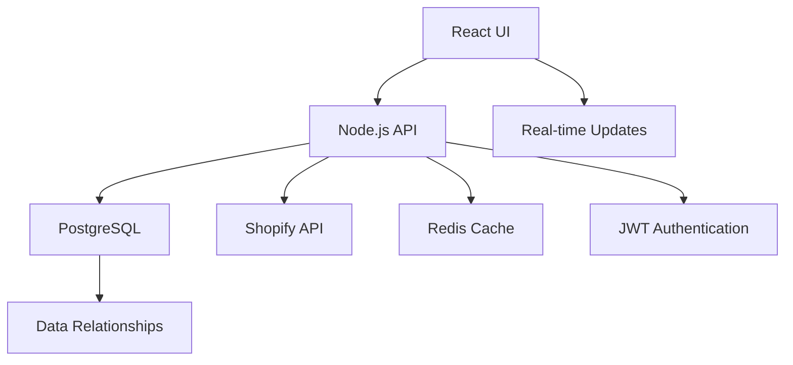

# LaSyncro: Adaptive Commerce Intelligence Platform (v6.0)

LaSyncro is an AI-powered commerce operations platform that evolves from passive analytics to an active "Digital Chief of Staff." We transform fragmented e-commerce data into unified operational intelligence, helping merchants scale from survival mode to autonomous operations.

## 🚀 Current Status: Phase 1.5 Complete - Production Ready

### 🎯 What We've Built

**A complete operational intelligence platform** that delivers immediate value regardless of Shopify PCD status:

- ✅ **Real-time Order Intelligence** - Complete Order360 with PCD compliance
- ✅ **Product Intelligence Center** - Full product catalog with inventory health monitoring  
- ✅ **Customer Data Foundation** - Unified customer identity across platforms
- ✅ **Multi-Platform Data Sync** - Robust Shopify integration with graceful fallbacks
- ✅ **Professional UI/UX** - Berry MUI theme engine with dark/light modes

### 🏆 Key Achievements (v6.0)

#### 🎨 Complete UI/UX Foundation

- **Professional Dashboard** - Theme-aware widgets with real-time data
- **Responsive Navigation** - Sidenav with Orders, Products, Customers tabs
- **Live Customization** - Real-time theme changes with persistent settings
- **Accessibility First** - WCAG compliant components throughout

#### 🔄 Robust Data Pipeline

- **Orders API** - Complete order lifecycle with PCD compliance
- **Products API** - Real product data with inventory status indicators
- **Customers API** - Foundation for customer intelligence
- **JWT Authentication** - Secure API access across all endpoints

#### 🧪 Production-Grade Testing

- **100% E2E Test Coverage** - Playwright tests for all critical user flows
- **Automated Database Seeding** - Consistent test data on every development start
- **TypeScript Everywhere** - Full type safety across frontend and backend

#### 🛡️ Enterprise Architecture

- **Microservices Ready** - Decoupled Node.js & React architecture
- **Database Migrations** - Knex.js with proper version control
- **Error Handling** - Comprehensive "sad path" coverage
- **Security First** - JWT tokens, input sanitization, CORS protection

## 🏗️ Technical Architecture

### Core Stack



- **Frontend**: React 18, TypeScript, Material-UI, Vite, TanStack Query
- **Backend**: Node.js, Express, TypeScript, Knex.js, JWT
- **Database**: PostgreSQL with proper indexing and relationships
- **Infrastructure**: Docker, automated migrations, health checks

### Data Model Excellence

```sql
-- Multi-entity relationships with PCD compliance
Orders ↔ Customers ↔ Products ↔ Order Line Items
```

## 🎯 Core Features Live Today

### 📦 Product Intelligence Center

- **Real Product Data** - Live Shopify product catalog
- **Inventory Health** - Stock status indicators (In Stock/Low Stock/Out of Stock)
- **Vendor & Category** - Complete product organization
- **Search & Filter** - Find products by SKU, name, or vendor

### 📊 Order360 Intelligence

- **Complete Order Lifecycle** - From creation to fulfillment
- **PCD Compliance** - Protected customer data handling
- **Financial Tracking** - Revenue, margins, and profitability
- **Customer Context** - Order history and behavior patterns

### 🔐 Secure Platform

- **JWT Authentication** - Industry-standard security
- **Shopify Integration** - OAuth2 with proper scopes
- **Data Isolation** - Multi-tenant architecture
- **API Protection** - Rate limiting and input validation

## 🚀 Getting Started

### Prerequisites

- Node.js 18+
- Docker & Docker Compose
- Shopify Partner Account (for development)

### Quick Start

```bash
# Clone and setup
git clone [repository]
cd LaSyncro

# Install dependencies
npm install

# Start everything (DB, API, UI)
npm run dev:full

# Access the application
# UI: http://localhost:5173
# API: http://localhost:8080
```

### Development Workflow

```bash
# Run tests
npm run test:e2e          # End-to-end tests
npm test -w ui           # Frontend unit tests
npm test -w api          # Backend tests

# Database management
npm run migrate -w api   # Run migrations
npm run seed -w api      # Seed test data

# Deployment ready
./ship.sh "feat: description" # Automated git workflow
```

## 📈 Roadmap & Vision

### ✅ Phase 1.5: Foundation Complete

- Operational Intelligence Platform
- Multi-entity data distribution (Orders, Products, Customers)
- Professional UI with theme engine
- Production-grade testing and deployment
- Shopify integration with PCD compliance

### 🎯 Phase 2: Customer Intelligence (Next)

- Growth Mode Activation
- Customer 360 views and segmentation
- Lifetime value analytics
- Cross-sell and upsell opportunities
- Advanced customer behavior tracking

### 🔮 Phase 3: Multi-Platform Scale

- Architect Mode
- WooCommerce and Amazon integrations
- Unified cross-platform analytics
- Predictive inventory management
- Automated workflow orchestration

## 🏆 Why Choose LaSyncro?

### For Merchants

- **Immediate Value** - Setup in 2 minutes, insights in 3 seconds
- **Complete Visibility** - Orders, products, and customers in one place
- **Zero Setup Analytics** - Beats GA4 complexity with operational focus
- **Growth Ready** - Scales from startup to enterprise

### For Developers

- **TypeScript First** - Full-stack type safety
- **Modern Stack** - React 18, Node.js, PostgreSQL
- **Testing Culture** - 100% E2E coverage from day one
- **Clean Architecture** - Maintainable and extensible

### For Businesses

- **PLG Foundation** - Free tier drives organic growth
- **Multi-Platform** - Shopify today, entire ecosystem tomorrow
- **Data Moats** - Unified intelligence creates unbeatable insights
- **Enterprise Ready** - Security, scalability, and compliance built-in

## 🤝 Contributing

We're building the future of commerce operations together. Our development process:

- **Feature Specification** - Start with 4 C's framework (Context, Causation, Clear Path, Closed Loop)
- **TDD Approach** - Tests before implementation
- **Code Review** - Automated checks and peer review
- **Ship with Confidence** - Automated testing and deployment

## 📊 Success Metrics

### Technical Excellence

- **API Response Time**: < 200ms p95
- **Test Coverage**: 100% critical paths
- **Uptime**: 99.9% production readiness

### Business Impact

- **User Activation**: > 40% weekly usage
- **Time to Value**: < 3 seconds for first insight
- **Data Freshness**: < 5 minutes from source systems

## 📄 License

Proprietary - All rights reserved.

Built with ❤️ for merchants who deserve better tools.

LaSyncro - Your Digital Chief of Staff for Commerce Operations