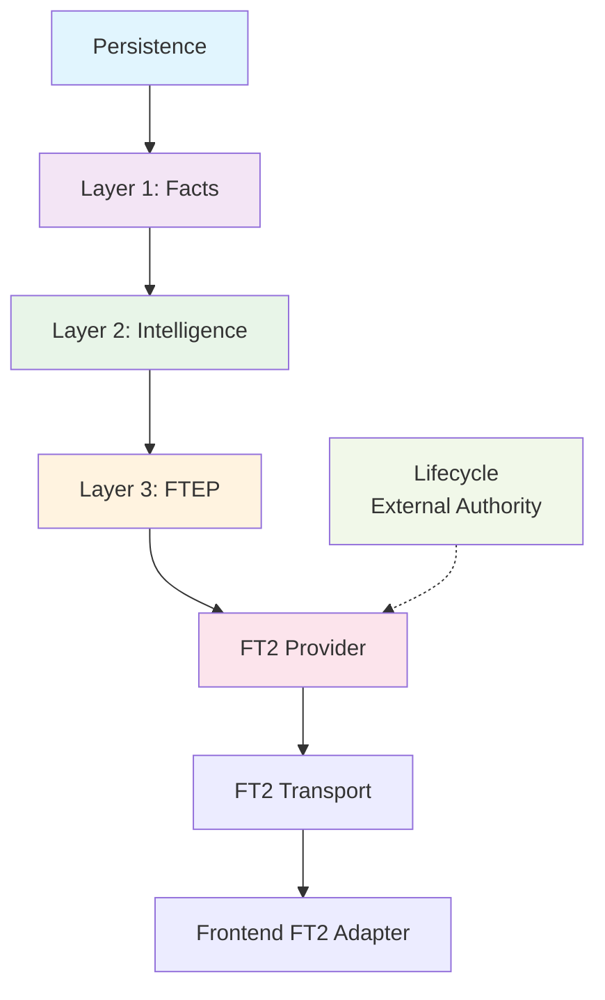

# 📐 FT2 Four-Layer Architecture

**Canonical Module Implementation Guide**

> **Architectural Mandate:** This document defines the **only approved way** to surface FT2 data for any module in the system. Deviation is not allowed without formal architectural review.

---

## 🎯 Core Objective

Provide **FT2 observability** for a module while guaranteeing these non-negotiable constraints:

* **No intelligence leakage**  
* **No causation or explanation**  
* **No recommendations**  
* **No UI coupling**  
* **Deterministic, testable behavior**  

**Key Principle:** FT2 is **read-only truth exposure**, not insight generation.

---

## 🧱 The Four-Layer Architecture (Non-Negotiable)



**Architectural Rule:** Each layer has:

* A single, well-defined responsibility
* A strict input/output contract
* Explicit, hard prohibitions
* Mandatory test coverage

---

## 1️⃣ **Layer 1 — Facts**

**Raw truth, zero interpretation**

### Purpose

Extract **raw, interpretation-free facts** directly from persistence.

### Permitted Operations ✓

* Query database tables
* Aggregate counts and totals
* Preserve `null` values exactly as stored
* Return timestamps without transformation

### Strict Prohibitions ✗

* **NO** classification (good/bad, healthy/risky)
* **NO** percentage computation (unless pre-stored)
* **NO** trend detection
* **NO** semantic labeling (e.g., "healthy", "risk", "loss")

---

### **File Structure**

```bash
apps/backend/src/services/<module>-facts/
├── <module>Facts.service.ts      # Core facts extraction
├── <module>Facts.types.ts        # Type definitions
└── index.ts                      # Public exports
```

### **Type Definition Example**

```typescript
export interface ModuleFacts {
  shopId: number;
  period: { from: string; to: string };

  // Raw counts only
  itemsObserved: number | null;

  // Direct persistence values
  totals: {
    valueA: number | null;
    valueB: number | null;
    currency: string | null;
  };

  // Only if stored as facts
  dataCoverage: {
    completenessPct: number | null;
  };

  // Metadata
  extractedAt: string;
}
```

### **Required Test Coverage**

* Returns raw persistence values exactly
* Preserves `null` values without conversion
* Emits **no** derived or calculated fields

---

## 2️⃣ **Layer 2 — Intelligence**

**Classification, nothing more**

### Purpose

Convert raw facts into **internal intelligence signals** for system use only.

### Permitted Operations ✓

* Classify outcomes (positive/negative/unknown)
* Derive directional trends (up/down/flat)
* Apply internal threshold logic

### Strict Prohibitions ✗

* **NO** database access (must use Facts layer)
* **NO** causality explanation
* **NO** action recommendations
* **NO** UI formatting
* **NO** direct exposure to frontend

---

### **File Structure**

```bash
apps/backend/src/services/<module>-intelligence/
├── <module>Intelligence.service.ts  # Classification logic
└── index.ts                         # Public exports
```

### **Input/Output Contract**

**Input:**

```typescript
facts: ModuleFacts
```

**Output:**

```typescript
export interface ModuleIntelligence {
  itemsObserved: number | null;

  outcome: {
    status: 'positive' | 'negative' | 'unknown';
  };

  trend: {
    direction: 'up' | 'down' | 'flat' | 'unknown';
  };

  dataCoveragePct: number | null;
}
```

### **Required Test Coverage**

* Deterministic output for identical inputs
* Returns `unknown` when facts are missing
* **Zero** persistence layer access

---

## 3️⃣ **Layer 3 — FTEP (Truth Exposure Policy)**

**Intelligence downgrade for safe exposure**

> **Security Boundary:** This layer exists solely to **prevent intelligence leakage** to FT2 consumers.

### Purpose

Transform internal intelligence into **FT2-safe observability data**.

### Permitted Operations ✓

* Drop sensitive fields
* Downgrade intelligence classifications
* Convert internal signals → neutral observability

### Strict Prohibitions ✗

* **NO** explanation of "why"
* **NO** percentage exposure if forbidden by policy
* **NO** exposure of raw intelligence structures
* **NO** introduction of new semantics

---

### **File Structure**

```bash
apps/backend/src/services/<module>-ftep/
├── <module>Ftep.service.ts      # Exposure policy logic
├── <module>Ftep.types.ts        # FT2-safe type definitions
└── index.ts                     # Public exports
```

### **Input/Output Contract**

**Input:**

```typescript
{
  facts: ModuleFacts;
  intelligence: ModuleIntelligence;
}
```

**Output (FT2-Safe Exposure):**

```typescript
export interface ModuleFT2Exposure {
  context: {
    period: { from: string; to: string };
    itemsObserved: number | null;
  };

  totals: {
    valueA: number | null;
    valueB: number | null;
    currency: string | null;
  };

  outcome: {
    status: 'positive' | 'negative' | 'unknown';
  } | null;  // May be null if policy forbids

  trend: {
    direction: 'up' | 'down' | 'flat' | 'unknown';
  } | null;  // May be null if policy forbids

  dataCoverage: {
    completenessPct: number | null;
  };
}
```

---

### **⚠️ Leak-Prevention Tests (MANDATORY)**

Every module **must** include these architectural guard tests:

```typescript
// Example test assertions
describe('FTEP Leak Prevention', () => {
  it('must not expose raw intelligence objects', () => { /* ... */ });
  it('must not expose forbidden percentages', () => { /* ... */ });
  it('must not contain explanation language', () => {
    const forbiddenWords = [
      'because', 'due to', 'reason', 
      'driver', 'caused', 'therefore'
    ];
    // Assert none appear in output
  });
  it('must not contain recommendation language', () => { /* ... */ });
});
```

**These are architectural guards, not business logic tests.**

---

## 4️⃣ **Layer 4 — FT2 Provider (Pipeline Orchestrator)**

**Pure orchestration, zero authority**

### Purpose

Orchestrate the complete FT2 pipeline deterministically:

```
Facts → Intelligence → FTEP → Return
```

The FT2 Provider is the **only permissible entry point** for executing the full FT2 pipeline.

---

### Permitted Operations ✓

* Call Facts layer
* Call Intelligence layer  
* Call FTEP layer
* Return FT2 exposure data

### Strict Prohibitions ✗

* **NO** lifecycle resolution
* **NO** FT2 eligibility gating
* **NO** lifecycle state mutation
* **NO** persistence writes
* **NO** data enrichment, explanation, or interpretation

---

### **Canonical Implementation Shape**

```typescript
export async function get<Module>Ft2Snapshot(input: {
  shopId: number;
  period: { from: string; to: string };
}): Promise<ModuleFT2Exposure> {
  // 1. Get facts
  const facts = await getModuleFacts(input);
  
  // 2. Get intelligence (internal only)
  const intelligence = await getModuleIntelligence(facts);
  
  // 3. Apply exposure policy
  const exposure = await getModuleFtep({ facts, intelligence });
  
  // 4. Return FT2-safe data
  return exposure;
}
```

### **Invariants**

* Deterministic output for identical inputs
* No enrichment beyond FTEP output
* No lifecycle coupling
* No intelligence leakage

### **Required Test Coverage**

* Verifies Facts → Intelligence → FTEP orchestration
* Verifies no mutation beyond FTEP output
* Verifies no exposure of facts or intelligence

> **Important:** Provider tests **MUST** mock modules (`jest.mock`), not spy on imports, due to ESM binding constraints.

---

## 5️⃣ **Lifecycle & Transport Integration**

**Architectural Principle:** Lifecycle owns eligibility and timing, but is **external** to FT2 execution.

### **Rule**

Modules **may expose FT2 via dedicated HTTP endpoints**, provided these conditions are met:

* Endpoint is **strictly read-only**
* Endpoint returns **FTEP output only**
* **No** lifecycle mutation occurs
* **No** intelligence or explanations are exposed
* FT2 Providers **must not** call lifecycle services
* FT2 Controllers **must not** gate lifecycle
* Lifecycle gating occurs **before** FT2 invocation or **after** FT2 fetching

**Lifecycle does not care how FT2 is transported** — only **when FT2 is considered active and usable**.

---

### **Implementation Pattern**

```
FT2 HTTP Controller
 └── calls <Module>Ft2Pipeline
       ├── Facts
       ├── Intelligence
       └── FTEP

Lifecycle Resolver (External)
 └── decides:
       * Whether FT2 is active
       * Whether FT2 is rendered in UI
       * Whether FT2 is persisted or latched
```

### **File Locations**

| Component | Location |
|-----------|----------|
| **FT2 Pipeline** | `apps/backend/src/services/<module>-facts`<br>`apps/backend/src/services/<module>-intelligence`<br>`apps/backend/src/services/<module>-ftep` |
| **FT2 Transport** (Optional) | `apps/backend/src/api/<module>/<module>.ft2.controller.ts` |
| **Lifecycle Authority** | `apps/backend/src/services/lifecycle.resolver.ts` |

### **Hard Invariants**

* **Transport MUST NOT:**
  * Gate lifecycle eligibility
  * Write state
  * Explain data
* **Lifecycle MUST NOT:**
  * Transform FT2 data
  * Inject semantics
  * Bypass FTEP layer

> **Separation of Concerns:** Lifecycle controls **timing and eligibility**. FTEP controls **truth exposure**.

---

## 🎨 **Frontend Adapter (Read-Only)**

### **Responsibilities**

* Normalize `undefined` → `null` values
* Preserve exact shape from backend
* Never infer missing data
* Never compute derived values

### **Assumption**

Frontend adapters assume the backend has **already enforced FTEP** — they are not responsible for security.

---

## 🧠 **Architectural Laws (Memorize These)**

| # | Law | Explanation |
|---|------|-------------|
| 1 | **Facts ≠ Intelligence** | Raw data must never be conflated with classification |
| 2 | **Intelligence ≠ Exposure** | Internal signals must never leak to FT2 |
| 3 | **Exposure ≠ Insight** | Observability does not imply understanding |
| 4 | **Lifecycle owns timing** | Only external authority controls when FT2 is active |
| 5 | **FTEP is the security boundary** | All exposure must pass through the policy layer |
| 6 | **Test for non-leakage** | If tests can't prove absence of leaks, the layer is incomplete |

---

## ✅ **Document Status**

This canonical architecture now defines:

* ✅ **The only approved FT2 implementation pattern**
* ✅ **Migration path for every existing module**
* ✅ **Architectural guardrails to prevent regression**
* ✅ **Clear separation of concerns between layers**
* ✅ **Enforceable test requirements**

---

**Last Updated:** Current  
**Architecture Version:** 1.0  
**Enforcement:** Required for all new modules; migration required for existing modules
