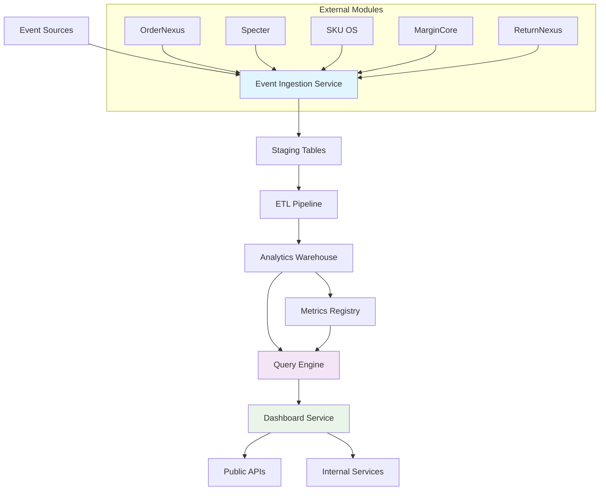

## **Document 5: InsightCore-Internal-Implementation.md**

```markdown
# InsightCore – Internal Implementation & Services

## **System Architecture Overview**

### **Core Subsystems**



## **1. Event Ingestion Service**

### **1.1 Event Consumers Implementation**

```typescript
// Base Consumer Interface
export interface AnalyticsEventConsumer<T> {
  handle(event: T): Promise<void>;
  validate(event: T): boolean;
  getEventType(): string;
}

// Order Analytics Event Consumer
export class OrderAnalyticsEventConsumerImpl 
  implements AnalyticsEventConsumer<OrderAnalyticsEvent> {
  
  constructor(
    private readonly db: DbClient,
    private readonly logger: Logger,
    private readonly metrics: MetricsCollector
  ) {}

  async handle(event: OrderAnalyticsEvent): Promise<void> {
    const startTime = Date.now();
    
    try {
      // Validation
      if (!this.validate(event)) {
        throw new Error('Invalid OrderAnalyticsEvent');
      }

      await this.db.query(
        `
        INSERT INTO fact_orders (
          shop_id, order_id, order_date,
          revenue_total, net_profit, margin_percent,
          profit_status, customer_profit_tier, channel,
          ingested_at
        ) VALUES ($1,$2,$3,$4,$5,$6,$7,$8,$9,NOW())
        ON CONFLICT (shop_id, order_id) DO UPDATE SET
          revenue_total = EXCLUDED.revenue_total,
          net_profit = EXCLUDED.net_profit,
          margin_percent = EXCLUDED.margin_percent,
          profit_status = EXCLUDED.profit_status,
          customer_profit_tier = EXCLUDED.customer_profit_tier,
          channel = EXCLUDED.channel,
          ingested_at = NOW()
        `,
        [
          event.shopId,
          event.orderId,
          event.orderDate,
          event.revenue,
          event.netProfit,
          event.marginPercent,
          event.profitStatus,
          event.customerProfitTier,
          event.channel
        ]
      );

      // Record metrics
      this.metrics.increment('insightcore.events.ingested', {
        event_type: 'order_analytics',
        shop_id: event.shopId.toString()
      });
      
      this.metrics.histogram('insightcore.ingestion.lag_ms', {
        event_type: 'order_analytics'
      }, Date.now() - new Date(event.orderDate).getTime());

    } catch (error) {
      this.logger.error('Failed to ingest OrderAnalyticsEvent', { 
        event,
        error: error.message 
      });
      
      this.metrics.increment('insightcore.events.failed', {
        event_type: 'order_analytics',
        error_type: error.constructor.name
      });
      
      throw error;
    } finally {
      this.metrics.histogram('insightcore.ingestion.processing_time_ms', {
        event_type: 'order_analytics'
      }, Date.now() - startTime);
    }
  }

  validate(event: OrderAnalyticsEvent): boolean {
    return (
      event.shopId > 0 &&
      event.orderId?.length > 0 &&
      event.orderDate &&
      !isNaN(event.revenue) &&
      !isNaN(event.netProfit) &&
      !isNaN(event.marginPercent) &&
      ['HEALTHY', 'AT_RISK', 'UNPROFITABLE'].includes(event.profitStatus)
    );
  }

  getEventType(): string {
    return 'order_analytics';
  }
}
```

### **1.2 Returns Analytics Event Consumer**

```typescript
export class ReturnAnalyticsEventConsumerImpl 
  implements AnalyticsEventConsumer<ReturnAnalyticsEvent> {
  
  constructor(
    private readonly db: DbClient,
    private readonly logger: Logger,
    private readonly metrics: MetricsCollector,
    private readonly enumValidator: ReturnsEnumValidator
  ) {}

  async handle(event: ReturnAnalyticsEvent): Promise<void> {
    const startTime = Date.now();
    
    try {
      // Validate enums against shared contract
      if (!this.enumValidator.isValidReasonCategory(event.reasonCategory) ||
          !this.enumValidator.isValidInspectionResult(event.inspectionResult) ||
          !this.enumValidator.isValidIssueRootCause(event.issueRootCause)) {
        throw new Error('Invalid returns quality enum values');
      }

      await this.db.query(
        `
        INSERT INTO fact_returns (
          shop_id, return_id, order_id, product_id, quantity,
          reason_category, inspection_result, issue_root_cause,
          refund_amount, currency, restockable,
          processed_at, ingested_at
        ) VALUES ($1,$2,$3,$4,$5,$6,$7,$8,$9,$10,$11,$12,NOW())
        ON CONFLICT (shop_id, return_id, product_id) DO UPDATE SET
          quantity = EXCLUDED.quantity,
          reason_category = EXCLUDED.reason_category,
          inspection_result = EXCLUDED.inspection_result,
          issue_root_cause = EXCLUDED.issue_root_cause,
          refund_amount = EXCLUDED.refund_amount,
          currency = EXCLUDED.currency,
          restockable = EXCLUDED.restockable,
          processed_at = EXCLUDED.processed_at,
          ingested_at = NOW()
        `,
        [
          event.shopId,
          event.returnId,
          event.orderId,
          event.productId,
          event.quantity,
          event.reasonCategory,
          event.inspectionResult,
          event.issueRootCause,
          event.refundAmount,
          event.currency,
          event.restockable,
          event.processedAt
        ]
      );

      // Update reference dimensions if new enum value
      await this.upsertReturnReasonReference(event.reasonCategory);
      await this.upsertIssueRootCauseReference(event.issueRootCause);

      // Record metrics
      this.metrics.increment('insightcore.returns.events.ingested', {
        shop_id: event.shopId.toString(),
        reason_category: event.reasonCategory
      });

    } catch (error) {
      this.logger.error('Failed to ingest ReturnAnalyticsEvent', { 
        event,
        error: error.message 
      });
      
      this.metrics.increment('insightcore.returns.events.failed', {
        reason_category: event.reasonCategory,
        error_type: error.constructor.name
      });
      
      throw error;
    } finally {
      this.metrics.histogram('insightcore.returns.ingestion.processing_time_ms', 
        {}, Date.now() - startTime);
    }
  }

  private async upsertReturnReasonReference(reasonCategory: string): Promise<void> {
    // Only insert if not exists - reference data loaded separately
    await this.db.query(
      `INSERT INTO dim_return_reason_category (reason_category) 
       VALUES ($1) ON CONFLICT DO NOTHING`,
      [reasonCategory]
    );
  }

  validate(event: ReturnAnalyticsEvent): boolean {
    return (
      event.shopId > 0 &&
      event.returnId?.length > 0 &&
      event.orderId?.length > 0 &&
      event.productId?.length > 0 &&
      event.quantity > 0 &&
      event.refundAmount >= 0 &&
      event.currency?.length === 3 &&
      event.processedAt &&
      typeof event.restockable === 'boolean'
    );
  }

  getEventType(): string {
    return 'return_analytics';
  }
}
```

### **1.3 Event Ingestion Orchestrator**

```typescript
export class EventIngestionOrchestrator {
  private consumers: Map<string, AnalyticsEventConsumer<any>> = new Map();
  private queue: AnalyticsEventQueue;
  private deadLetterQueue: DeadLetterQueue;

  constructor(
    private readonly logger: Logger,
    private readonly metrics: MetricsCollector
  ) {
    this.queue = new AnalyticsEventQueue();
    this.deadLetterQueue = new DeadLetterQueue();
  }

  registerConsumer<T>(consumer: AnalyticsEventConsumer<T>): void {
    this.consumers.set(consumer.getEventType(), consumer);
    this.logger.info(`Registered consumer for ${consumer.getEventType()}`);
  }

  async start(): Promise<void> {
    this.logger.info('Starting EventIngestionOrchestrator');
    
    // Start processing queue
    this.queue.consume(async (message) => {
      try {
        const event = JSON.parse(message.body);
        const consumer = this.consumers.get(event.type);
        
        if (!consumer) {
          this.logger.warn(`No consumer for event type: ${event.type}`);
          await this.deadLetterQueue.send(message);
          return;
        }

        await consumer.handle(event.data);
        await message.ack();
        
        this.metrics.increment('insightcore.events.processed', {
          event_type: event.type
        });

      } catch (error) {
        this.logger.error('Failed to process event', {
          messageId: message.id,
          error: error.message
        });
        
        await this.deadLetterQueue.send(message);
        this.metrics.increment('insightcore.events.dead_lettered', {
          event_type: event.type,
          error_type: error.constructor.name
        });
      }
    });
  }

  async stop(): Promise<void> {
    await this.queue.close();
    await this.deadLetterQueue.close();
    this.logger.info('Stopped EventIngestionOrchestrator');
  }
}
```

## **2. Metrics Registry Service**

### **2.1 Registry Implementation**

```typescript
export interface MetricsRegistry {
  getMetric(id: string): Promise<MetricDefinition | null>;
  getMetricByVersion(metricId: string, versionId: string): Promise<MetricDefinition | null>;
  listMetrics(options?: ListMetricsOptions): Promise<MetricDefinition[]>;
  getDimension(id: string): Promise<DimensionDefinition | null>;
  listDimensions(options?: ListDimensionsOptions): Promise<DimensionDefinition[]>;
  registerMetric(definition: MetricDefinition): Promise<void>;
  registerDimension(definition: DimensionDefinition): Promise<void>;
  deprecateMetric(metricId: string, deprecatedAt: string): Promise<void>;
}

export class MetricsRegistryImpl implements MetricsRegistry {
  private cache: LRUCache<string, MetricDefinition | DimensionDefinition>;
  private cacheTTL = 5 * 60 * 1000; // 5 minutes

  constructor(
    private readonly db: DbClient,
    private readonly logger: Logger,
    private readonly cacheEnabled: boolean = true
  ) {
    this.cache = new LRUCache({ max: 1000 });
  }

  async getMetric(id: string): Promise<MetricDefinition | null> {
    const cacheKey = `metric:${id}:latest`;
    
    if (this.cacheEnabled) {
      const cached = this.cache.get(cacheKey);
      if (cached) {
        return cached as MetricDefinition;
      }
    }

    const result = await this.db.query(
      `SELECT * FROM metric_definitions 
       WHERE id = $1 AND deprecated_at IS NULL 
       ORDER BY created_at DESC LIMIT 1`,
      [id]
    );

    if (result.rows.length === 0) {
      return null;
    }

    const metric = this.mapRowToMetricDefinition(result.rows[0]);
    
    if (this.cacheEnabled) {
      this.cache.set(cacheKey, metric, this.cacheTTL);
    }

    return metric;
  }

  async getMetricByVersion(metricId: string, versionId: string): Promise<MetricDefinition | null> {
    const cacheKey = `metric:${metricId}:${versionId}`;
    
    if (this.cacheEnabled) {
      const cached = this.cache.get(cacheKey);
      if (cached) {
        return cached as MetricDefinition;
      }
    }

    const result = await this.db.query(
      `SELECT * FROM metric_definitions 
       WHERE id = $1 AND version_id = $2`,
      [metricId, versionId]
    );

    if (result.rows.length === 0) {
      return null;
    }

    const metric = this.mapRowToMetricDefinition(result.rows[0]);
    
    if (this.cacheEnabled) {
      this.cache.set(cacheKey, metric);
    }

    return metric;
  }

  async listMetrics(options?: ListMetricsOptions): Promise<MetricDefinition[]> {
    const { 
      includeDeprecated = false,
      sourceTable,
      unit,
      limit = 100,
      offset = 0 
    } = options || {};

    let query = `SELECT * FROM metric_definitions WHERE 1=1`;
    const params: any[] = [];
    let paramIndex = 1;

    if (!includeDeprecated) {
      query += ` AND deprecated_at IS NULL`;
    }

    if (sourceTable) {
      query += ` AND source_table = $${paramIndex}`;
      params.push(sourceTable);
      paramIndex++;
    }

    if (unit) {
      query += ` AND unit = $${paramIndex}`;
      params.push(unit);
      paramIndex++;
    }

    query += ` ORDER BY created_at DESC LIMIT $${paramIndex} OFFSET $${paramIndex + 1}`;
    params.push(limit, offset);

    const result = await this.db.query(query, params);
    return result.rows.map(row => this.mapRowToMetricDefinition(row));
  }

  async registerMetric(definition: MetricDefinition): Promise<void> {
    // Validate metric expression
    if (!this.isValidExpression(definition.expression, definition.sourceTable)) {
      throw new Error(`Invalid metric expression: ${definition.expression}`);
    }

    // Check for existing active metric with same ID
    const existing = await this.getMetric(definition.id);
    if (existing && !existing.deprecatedAt) {
      throw new Error(`Metric ${definition.id} already exists and is not deprecated`);
    }

    await this.db.query(
      `INSERT INTO metric_definitions (
        id, version_id, name, description,
        source_table, expression, aggregation, unit, created_at
      ) VALUES ($1, $2, $3, $4, $5, $6, $7, $8, $9)`,
      [
        definition.id,
        definition.versionId,
        definition.name,
        definition.description,
        definition.sourceTable,
        definition.expression,
        definition.aggregation,
        definition.unit,
        definition.createdAt
      ]
    );

    // Clear cache for this metric
    this.cache.delete(`metric:${definition.id}:latest`);
    
    this.logger.info(`Registered metric: ${definition.id} (${definition.versionId})`);
  }

  private isValidExpression(expression: string, sourceTable: string): boolean {
    // Basic SQL injection prevention and syntax validation
    const allowedFunctions = ['sum', 'avg', 'count', 'min', 'max', 'distinct'];
    const allowedColumns = this.getTableColumns(sourceTable);
    
    // Simple validation - in production would use proper SQL parser
    return !/(delete|update|insert|drop|truncate|exec)/i.test(expression);
  }

  private mapRowToMetricDefinition(row: any): MetricDefinition {
    return {
      id: row.id,
      versionId: row.version_id,
      name: row.name,
      description: row.description,
      sourceTable: row.source_table,
      expression: row.expression,
      aggregation: row.aggregation,
      unit: row.unit,
      createdAt: row.created_at,
      deprecatedAt: row.deprecated_at
    };
  }

  // Similar implementations for dimension methods...
}
```

### **2.2 Seeded Metric Definitions**

```typescript
// Initial v1 metric definitions
export const SEEDED_METRICS: MetricDefinition[] = [
  // Orders & Profitability
  {
    id: 'revenue_total',
    versionId: 'v1-2024-01-01',
    name: 'Total Revenue',
    description: 'Sum of all order revenue',
    sourceTable: 'fact_orders',
    expression: 'sum(revenue_total)',
    aggregation: 'sum',
    unit: 'currency',
    createdAt: '2024-01-01T00:00:00Z'
  },
  {
    id: 'net_profit',
    versionId: 'v1-2024-01-01',
    name: 'Net Profit',
    description: 'Sum of all order net profit',
    sourceTable: 'fact_orders',
    expression: 'sum(net_profit)',
    aggregation: 'sum',
    unit: 'currency',
    createdAt: '2024-01-01T00:00:00Z'
  },
  {
    id: 'margin_percent_avg',
    versionId: 'v1-2024-01-01',
    name: 'Average Margin %',
    description: 'Average margin percentage across all orders',
    sourceTable: 'fact_orders',
    expression: 'avg(margin_percent)',
    aggregation: 'avg',
    unit: 'percent',
    createdAt: '2024-01-01T00:00:00Z'
  },
  {
    id: 'orders_count',
    versionId: 'v1-2024-01-01',
    name: 'Order Count',
    description: 'Count of all orders',
    sourceTable: 'fact_orders',
    expression: 'count(*)',
    aggregation: 'count',
    unit: 'count',
    createdAt: '2024-01-01T00:00:00Z'
  },
  
  // Returns & Quality
  {
    id: 'returns_count',
    versionId: 'v1-2024-01-01',
    name: 'Return Count',
    description: 'Count of all return lines',
    sourceTable: 'fact_returns',
    expression: 'count(*)',
    aggregation: 'count',
    unit: 'count',
    createdAt: '2024-01-01T00:00:00Z'
  },
  {
    id: 'return_rate',
    versionId: 'v1-2024-01-01',
    name: 'Return Rate',
    description: 'Percentage of orders with returns',
    sourceTable: 'fact_returns',
    expression: 'count(distinct order_id) / (SELECT count(*) FROM fact_orders fo WHERE fo.shop_id = fr.shop_id AND fo.order_date >= $time_range_start)',
    aggregation: 'avg',
    unit: 'percent',
    createdAt: '2024-01-01T00:00:00Z'
  },
  {
    id: 'refund_amount_total',
    versionId: 'v1-2024-01-01',
    name: 'Total Refunds',
    description: 'Sum of all refund amounts',
    sourceTable: 'fact_returns',
    expression: 'sum(refund_amount)',
    aggregation: 'sum',
    unit: 'currency',
    createdAt: '2024-01-01T00:00:00Z'
  },
  {
    id: 'restockable_rate',
    versionId: 'v1-2024-01-01',
    name: 'Restockable Rate',
    description: 'Percentage of returns that are restockable',
    sourceTable: 'fact_returns',
    expression: 'sum(case when restockable then 1 else 0 end)::float / count(*)',
    aggregation: 'avg',
    unit: 'percent',
    createdAt: '2024-01-01T00:00:00Z'
  },
  
  // Nudge Analytics
  {
    id: 'nudge_impressions',
    versionId: 'v1-2024-01-01',
    name: 'Nudge Impressions',
    description: 'Count of nudge displays',
    sourceTable: 'fact_nudges',
    expression: 'count(*)',
    aggregation: 'count',
    unit: 'count',
    createdAt: '2024-01-01T00:00:00Z'
  },
  {
    id: 'nudge_click_rate',
    versionId: 'v1-2024-01-01',
    name: 'Nudge Click Rate',
    description: 'Percentage of nudges clicked',
    sourceTable: 'fact_nudges',
    expression: 'sum(case when clicked then 1 else 0 end)::float / count(*)',
    aggregation: 'avg',
    unit: 'percent',
    createdAt: '2024-01-01T00:00:00Z'
  },
  
  // Product Health
  {
    id: 'avg_health_score',
    versionId: 'v1-2024-01-01',
    name: 'Average Health Score',
    description: 'Average product health score',
    sourceTable: 'fact_product_health',
    expression: 'avg(health_score)',
    aggregation: 'avg',
    unit: 'ratio',
    createdAt: '2024-01-01T00:00:00Z'
  },
  {
    id: 'stockout_risk_avg',
    versionId: 'v1-2024-01-01',
    name: 'Average Stockout Risk',
    description: 'Average stockout risk across products',
    sourceTable: 'fact_product_health',
    expression: 'avg(stockout_risk)',
    aggregation: 'avg',
    unit: 'ratio',
    createdAt: '2024-01-01T00:00:00Z'
  }
];
```

## **3. Query Engine Service**

### **3.1 Query Service Implementation**

```typescript
export interface QueryService {
  execute(query: AnalyticsQuery): Promise<AnalyticsQueryResult>;
  validate(query: AnalyticsQuery): Promise<ValidationResult>;
  getQueryPlan(query: AnalyticsQuery): Promise<QueryPlan>;
}

export class QueryServiceImpl implements QueryService {
  private queryCache: QueryCache;
  private rateLimiter: RateLimiter;

  constructor(
    private readonly db: DbClient,
    private readonly metricsRegistry: MetricsRegistry,
    private readonly logger: Logger,
    private readonly config: QueryServiceConfig
  ) {
    this.queryCache = new QueryCache(config.cacheSize);
    this.rateLimiter = new RateLimiter(config.maxQueriesPerMinute);
  }

  async execute(query: AnalyticsQuery): Promise<AnalyticsQueryResult> {
    const startTime = Date.now();
    const queryId = this.generateQueryId(query);
    
    try {
      // Rate limiting
      await this.rateLimiter.checkLimit(query.shopId);
      
      // Validate query
      const validation = await this.validate(query);
      if (!validation.isValid) {
        throw new QueryValidationError(validation.errors);
      }

      // Check cache
      const cacheKey = this.getCacheKey(query);
      const cachedResult = this.queryCache.get(cacheKey);
      
      if (cachedResult && !this.isCacheExpired(cachedResult, query)) {
        this.logger.debug('Cache hit for query', { queryId });
        this.metrics.increment('insightcore.query.cache_hits');
        return cachedResult;
      }

      // Generate and execute SQL
      const sql = this.generateSQL(query);
      this.logger.debug('Executing query', { queryId, sql: sql.substring(0, 200) });
      
      const result = await this.db.query(sql);
      
      // Map to AnalyticsQueryResult
      const analyticsResult: AnalyticsQueryResult = {
        rows: result.rows.map(row => this.mapRowToAnalyticsRow(row, query)),
        meta: {
          queryId,
          generatedAt: new Date().toISOString(),
          metricVersions: await this.getMetricVersions(query.metrics)
        }
      };

      // Cache result
      this.queryCache.set(cacheKey, analyticsResult, this.config.cacheTTL);
      
      // Record metrics
      const duration = Date.now() - startTime;
      this.metrics.histogram('insightcore.query.duration_ms', {}, duration);
      this.metrics.increment('insightcore.query.executions', {
        shop_id: query.shopId.toString()
      });

      return analyticsResult;

    } catch (error) {
      this.logger.error('Query execution failed', { 
        queryId,
        error: error.message,
        query: JSON.stringify(query)
      });
      
      this.metrics.increment('insightcore.query.errors', {
        error_type: error.constructor.name,
        shop_id: query.shopId.toString()
      });
      
      throw new QueryExecutionError(`Failed to execute query: ${error.message}`);
    }
  }

  private generateSQL(query: AnalyticsQuery): string {
    const builder = new SQLBuilder();
    
    // SELECT clause
    const selectColumns = [
      ...query.dimensions?.map(dim => `${dim} AS ${dim}`) || [],
      ...query.metrics.map(metric => this.getMetricExpression(metric))
    ];
    
    builder.select(selectColumns.join(', '));
    
    // FROM clause - determine primary table
    const primaryTable = this.determinePrimaryTable(query);
    builder.from(primaryTable);
    
    // JOINs
    this.addJoins(builder, query, primaryTable);
    
    // WHERE clause
    this.addFilters(builder, query);
    
    // GROUP BY
    if (query.dimensions?.length) {
      builder.groupBy(query.dimensions.join(', '));
    }
    
    // ORDER BY
    if (query.orderBy?.length) {
      query.orderBy.forEach(order => {
        builder.orderBy(order.metric, order.direction);
      });
    }
    
    // LIMIT
    if (query.limit) {
      builder.limit(query.limit);
    }
    
    return builder.build();
  }

  private determinePrimaryTable(query: AnalyticsQuery): string {
    // Determine which fact table to use based on metrics
    const metricTables = new Set<string>();
    
    for (const metricId of query.metrics) {
      const metric = this.metricsRegistry.getMetric(metricId);
      if (metric) {
        metricTables.add(metric.sourceTable);
      }
    }
    
    // Default to orders if multiple or ambiguous
    if (metricTables.size === 1) {
      return Array.from(metricTables)[0];
    }
    
    return 'fact_orders'; // Default primary table
  }

  private getMetricExpression(metricId: string): string {
    const metric = this.metricsRegistry.getMetric(metricId);
    if (!metric) {
      throw new Error(`Unknown metric: ${metricId}`);
    }
    
    // Apply aggregation function
    const aggregation = metric.aggregation.toUpperCase();
    const expression = metric.expression;
    
    return `${aggregation}(${expression}) AS ${metricId}`;
  }

  private async getMetricVersions(metricIds: string[]): Promise<Record<string, string>> {
    const versions: Record<string, string> = {};
    
    for (const metricId of metricIds) {
      const metric = await this.metricsRegistry.getMetric(metricId);
      if (metric) {
        versions[metricId] = metric.versionId;
      }
    }
    
    return versions;
  }

  private mapRowToAnalyticsRow(row: any, query: AnalyticsQuery): AnalyticsRow {
    const dimensions: Record<string, string | number | null> = {};
    const metrics: Record<string, number | null> = {};
    
    // Extract dimensions
    query.dimensions?.forEach(dim => {
      dimensions[dim] = row[dim] !== undefined ? row[dim] : null;
    });
    
    // Extract metrics
    query.metrics.forEach(metric => {
      metrics[metric] = row[metric] !== undefined ? Number(row[metric]) : null;
    });
    
    return { dimensions, metrics };
  }

  private generateQueryId(query: AnalyticsQuery): string {
    const hashInput = JSON.stringify({
      metrics: query.metrics.sort(),
      dimensions: query.dimensions?.sort(),
      filters: query.filters,
      timeRange: query.timeRange,
      shopId: query.shopId
    });
    
    return createHash('sha256').update(hashInput).digest('hex').substring(0, 16);
  }
}
```

## **4. Dashboard Service**

### **4.1 Dashboard Service Implementation**

```typescript
export interface DashboardService {
  getDashboardConfig(id: string, shopId: number): Promise<DashboardConfig>;
  listDashboards(shopId: number): Promise<DashboardConfig[]>;
  getDashboardData(id: string, shopId: number, options?: DashboardOptions): Promise<DashboardData>;
  validateWidgetConfig(config: DashboardWidgetConfig): Promise<ValidationResult>;
}

export class DashboardServiceImpl implements DashboardService {
  private dashboardRegistry: Map<string, DashboardConfig>;
  private widgetValidators: Map<string, WidgetValidator>;

  constructor(
    private readonly modulePresence: ModulePresenceManager,
    private readonly queryService: QueryService,
    private readonly metricsRegistry: MetricsRegistry,
    private readonly logger: Logger
  ) {
    this.dashboardRegistry = new Map();
    this.widgetValidators = new Map();
    this.initializeRegistry();
    this.initializeValidators();
  }

  private initializeRegistry(): void {
    // Register v1 dashboards
    this.dashboardRegistry.set('profitability_overview', PROFITABILITY_DASHBOARD);
    this.dashboardRegistry.set('returns_quality_overview', RETURNS_QUALITY_DASHBOARD);
    this.dashboardRegistry.set('product_health', PRODUCT_HEALTH_DASHBOARD);
    this.dashboardRegistry.set('nudge_performance', NUDGE_PERFORMANCE_DASHBOARD);
    this.dashboardRegistry.set('cost_model_impact', COST_MODEL_IMPACT_DASHBOARD);
  }

  async getDashboardConfig(id: string, shopId: number): Promise<DashboardConfig> {
    const baseConfig = this.dashboardRegistry.get(id);
    if (!baseConfig) {
      throw new Error(`Unknown dashboard: ${id}`);
    }

    // Check module presence
    const presence = await this.modulePresence.getModulePresence(shopId);
    const missingModules = baseConfig.requiredModules.filter(
      module => !presence[this.mapModuleKey(module)]
    );

    // Return config with availability flags
    return {
      ...baseConfig,
      metadata: {
        ...baseConfig.metadata,
        available: missingModules.length === 0,
        missingModules,
        lastChecked: new Date().toISOString()
      }
    };
  }

  async listDashboards(shopId: number): Promise<DashboardConfig[]> {
    const presence = await this.modulePresence.getModulePresence(shopId);
    const availableDashboards: DashboardConfig[] = [];

    for (const [id, config] of this.dashboardRegistry.entries()) {
      const missingModules = config.requiredModules.filter(
        module => !presence[this.mapModuleKey(module)]
      );

      if (missingModules.length === 0) {
        availableDashboards.push({
          ...config,
          metadata: {
            ...config.metadata,
            available: true,
            missingModules: [],
            lastChecked: new Date().toISOString()
          }
        });
      }
    }

    return availableDashboards;
  }

  async getDashboardData(
    id: string, 
    shopId: number, 
    options?: DashboardOptions
  ): Promise<DashboardData> {
    const config = await this.getDashboardConfig(id, shopId);
    
    if (!config.metadata?.available) {
      throw new Error(`Dashboard ${id} not available for shop ${shopId}`);
    }

    const widgetPromises = config.widgets.map(async (widget) => {
      try {
        const data = await this.getWidgetData(widget, shopId, options);
        return {
          widgetId: widget.id,
          data,
          status: 'success' as const,
          refreshedAt: new Date().toISOString()
        };
      } catch (error) {
        this.logger.error('Failed to load widget data', {
          widgetId: widget.id,
          dashboardId: id,
          error: error.message
        });
        
        return {
          widgetId: widget.id,
          data: null,
          status: 'error' as const,
          error: error.message,
          refreshedAt: new Date().toISOString()
        };
      }
    });

    const widgetResults = await Promise.allSettled(widgetPromises);
    const widgets = widgetResults.map(result => 
      result.status === 'fulfilled' ? result.value : {
        widgetId: 'unknown',
        data: null,
        status: 'error' as const,
        error: 'Promise rejected',
        refreshedAt: new Date().toISOString()
      }
    );

    return {
      dashboardId: id,
      shopId,
      widgets,
      generatedAt: new Date().toISOString(),
      configVersion: config.metadata?.version || 'v1'
    };
  }

  private async getWidgetData(
    widget: DashboardWidgetConfig,
    shopId: number,
    options?: DashboardOptions
  ): Promise<any> {
    switch (widget.kind) {
      case 'line':
      case 'bar':
      case 'table':
        if (!widget.query) {
          throw new Error(`Widget ${widget.id} missing query configuration`);
        }
        
        // Hydrate query template with shop context
        const hydratedQuery = this.hydrateQuery(widget.query, shopId, options);
        return await this.queryService.execute(hydratedQuery);
        
      case 'top_driver':
        return await this.getTopDriverData(widget, shopId, options);
        
      case 'business_baseline':
        return await this.getBusinessBaselineData(widget, shopId, options);
        
      case 'correlation_panel':
        return await this.getCorrelationPanelData(widget, shopId, options);
        
      default:
        throw new Error(`Unsupported widget kind: ${widget.kind}`);
    }
  }

  private async getTopDriverData(
    widget: DashboardWidgetConfig,
    shopId: number,
    options?: DashboardOptions
  ): Promise<TopDriverData> {
    const outcomeMetric = widget.outcomeMetric || 'net_profit';
    const topN = widget.topN || 3;
    
    // v1 lightweight heuristic: correlation-based driver identification
    const candidateDrivers = await this.getCandidateDrivers(shopId, outcomeMetric, options);
    
    // Calculate correlations
    const driversWithCorrelation = await Promise.all(
      candidateDrivers.map(async driver => ({
        driver,
        correlation: await this.calculateCorrelation(
          shopId,
          outcomeMetric,
          driver,
          options?.timeRange
        )
      }))
    );
    
    // Sort by absolute correlation and take top N
    const topDrivers = driversWithCorrelation
      .sort((a, b) => Math.abs(b.correlation) - Math.abs(a.correlation))
      .slice(0, topN)
      .map((item, index) => ({
        rank: index + 1,
        driverMetric: item.driver,
        correlation: item.correlation,
        impactEstimate: this.estimateImpact(item.correlation),
        confidence: this.calculateConfidence(item.correlation)
      }));
    
    return {
      outcomeMetric,
      timeRange: options?.timeRange,
      drivers: topDrivers,
      calculatedAt: new Date().toISOString()
    };
  }

  private hydrateQuery(
    queryTemplate: AnalyticsQuery,
    shopId: number,
    options?: DashboardOptions
  ): AnalyticsQuery {
    return {
      ...queryTemplate,
      shopId,
      timeRange: options?.timeRange || queryTemplate.timeRange,
      filters: [
        ...(queryTemplate.filters || []),
        ...(options?.filters || [])
      ]
    };
  }

  private mapModuleKey(module: string): keyof ModulePresence {
    // Map kebab-case to camelCase
    const mapping: Record<string, keyof ModulePresence> = {
      'order-nexus': 'orderNexus',
      'return-nexus': 'returnNexus',
      'sku-os': 'skuOs',
      'margincore': 'marginCore',
      'specter': 'specter',
      'wms-lite': 'wmsLite',
      'echo-hub': 'echoHub'
    };
    
    return mapping[module] || module as keyof ModulePresence;
  }
}
```

## **5. Internal APIs & Services**

### **5.1 Readiness Computation Service**

```typescript
export class ReadinessComputationService {
  constructor(
    private readonly db: DbClient,
    private readonly logger: Logger,
    private readonly config: ReadinessConfig
  ) {}

  async computeReadiness(shopId: number): Promise<InsightCoreReadiness> {
    const [
      orderStats,
      returnStats,
      nudgeStats,
      productHealthStats,
      costModelStats
    ] = await Promise.all([
      this.getOrderStats(shopId),
      this.getReturnStats(shopId),
      this.getNudgeStats(shopId),
      this.getProductHealthStats(shopId),
      this.getCostModelStats(shopId)
    ]);

    const state = this.determineState(
      orderStats,
      returnStats,
      nudgeStats,
      productHealthStats,
      costModelStats
    );

    const canShowProfitability = this.canShowProfitabilityDashboards(orderStats);
    const canShowReturns = returnStats.hasEvents;
    const canShowNudges = nudgeStats.hasEvents;
    const canShowProductHealth = productHealthStats.hasEvents;

    const blockingReasons = this.getBlockingReasons(
      orderStats,
      state,
      canShowProfitability
    );

    const warnings = this.getWarnings(
      orderStats,
      returnStats,
      nudgeStats,
      productHealthStats,
      costModelStats
    );

    return {
      shopId,
      state,
      hasOrderAnalytics: orderStats.hasEvents,
      hasReturnAnalytics: returnStats.hasEvents,
      hasNudgeAnalytics: nudgeStats.hasEvents,
      hasProductHealthAnalytics: productHealthStats.hasEvents,
      hasCostModelAnalytics: costModelStats.hasEvents,
      lastOrderEventAt: orderStats.lastEventAt,
      lastReturnEventAt: returnStats.lastEventAt,
      lastNudgeEventAt: nudgeStats.lastEventAt,
      lastProductHealthEventAt: productHealthStats.lastEventAt,
      lastCostModelEventAt: costModelStats.lastEventAt,
      ordersLast30d: orderStats.countLast30d,
      returnsLast30d: returnStats.countLast30d,
      canShowProfitabilityDashboards: canShowProfitability,
      canShowReturnsDashboards: canShowReturns,
      canShowNudgesDashboards: canShowNudges,
      canShowProductHealthDashboards: canShowProductHealth,
      blockingReasons,
      warnings,
      computedAt: new Date().toISOString()
    };
  }

  private async getOrderStats(shopId: number): Promise<ModuleStats> {
    const result = await this.db.query(
      `SELECT 
         COUNT(*) as total_count,
         COUNT(CASE WHEN order_date >= NOW() - INTERVAL '30 days' THEN 1 END) as last_30d_count,
         MAX(order_date) as last_event_at
       FROM fact_orders 
       WHERE shop_id = $1`,
      [shopId]
    );

    const row = result.rows[0];
    return {
      hasEvents: row.total_count > 0,
      countLast30d: parseInt(row.last_30d_count) || 0,
      lastEventAt: row.last_event_at,
      isFresh: row.last_event_at ? 
        new Date(row.last_event_at) > new Date(Date.now() - 7 * 24 * 60 * 60 * 1000) : 
        false
    };
  }

  private determineState(...stats: ModuleStats[]): InsightCoreShopState {
    // Implementation of state determination logic
    // Based on thresholds defined in the readiness contract
    
    if (stats.every(s => !s.hasEvents)) {
      return 'INSTALLED_NO_DATA';
    }
    
    if (stats.some(s => s.hasEvents && !s.isFresh)) {
      return 'DEGRADED';
    }
    
    // Check if core profitability is viable
    const orderStats = stats[0]; // orders is first
    if (orderStats.hasEvents && orderStats.countLast30d >= 10 && orderStats.isFresh) {
      return 'READY';
    }
    
    return 'LEARNING';
  }

  private canShowProfitabilityDashboards(orderStats: ModuleStats): boolean {
    return orderStats.hasEvents && orderStats.countLast30d >= 10 && orderStats.isFresh;
  }
}
```

## **6. Performance & Scaling Considerations**

### **6.1 Caching Strategy**

```typescript
export class QueryCache {
  private cache: Map<string, CachedResult>;
  private maxSize: number;
  private ttl: number;

  constructor(maxSize: number = 1000, ttl: number = 5 * 60 * 1000) {
    this.cache = new Map();
    this.maxSize = maxSize;
    this.ttl = ttl;
  }

  get(key: string): AnalyticsQueryResult | null {
    const cached = this.cache.get(key);
    
    if (!cached) {
      return null;
    }

    if (Date.now() - cached.timestamp > this.ttl) {
      this.cache.delete(key);
      return null;
    }

    return cached.result;
  }

  set(key: string, result: AnalyticsQueryResult, customTTL?: number): void {
    // Evict if cache is full (LRU strategy)
    if (this.cache.size >= this.maxSize) {
      const oldestKey = this.getOldestKey();
      this.cache.delete(oldestKey);
    }

    this.cache.set(key, {
      result,
      timestamp: Date.now(),
      ttl: customTTL || this.ttl
    });
  }

  private getOldestKey(): string {
    let oldestKey = '';
    let oldestTimestamp = Date.now();
    
    for (const [key, value] of this.cache.entries()) {
      if (value.timestamp < oldestTimestamp) {
        oldestTimestamp = value.timestamp;
        oldestKey = key;
      }
    }
    
    return oldestKey;
  }
}
```

### **6.2 Rate Limiting**

```typescript
export class RateLimiter {
  private limits: Map<number, RequestLog[]>;
  private windowMs: number;
  private maxRequests: number;

  constructor(maxRequests: number = 60, windowMs: number = 60 * 1000) {
    this.limits = new Map();
    this.windowMs = windowMs;
    this.maxRequests = maxRequests;
  }

  async checkLimit(shopId: number): Promise<void> {
    const now = Date.now();
    const windowStart = now - this.windowMs;

    // Get or create request log for shop
    let requests = this.limits.get(shopId) || [];
    
    // Filter out old requests
    requests = requests.filter(req => req.timestamp > windowStart);
    
    // Check if limit exceeded
    if (requests.length >= this.maxRequests) {
      throw new RateLimitError(
        `Rate limit exceeded: ${this.maxRequests} requests per minute`
      );
    }

    // Add new request
    requests.push({ timestamp: now });
    this.limits.set(shopId, requests);
    
    // Cleanup old entries periodically
    this.cleanup();
  }

  private cleanup(): void {
    const now = Date.now();
    const windowStart = now - this.windowMs * 2; // Cleanup older than 2 windows
    
    for (const [shopId, requests] of this.limits.entries()) {
      const filtered = requests.filter(req => req.timestamp > windowStart);
      
      if (filtered.length === 0) {
        this.limits.delete(shopId);
      } else {
        this.limits.set(shopId, filtered);
      }
    }
  }
}
```

## **7. Deployment & Configuration**

### **7.1 Environment Configuration**

```typescript
export interface InsightCoreConfig {
  database: {
    host: string;
    port: number;
    database: string;
    user: string;
    password: string;
    poolSize: number;
    connectionTimeout: number;
  };
  
  caching: {
    enabled: boolean;
    ttl: number; // milliseconds
    maxSize: number;
  };
  
  ingestion: {
    batchSize: number;
    flushInterval: number;
    retryAttempts: number;
    deadLetterQueueEnabled: boolean;
  };
  
  query: {
    timeout: number;
    maxResults: number;
    cacheEnabled: boolean;
    rateLimitPerMinute: number;
  };
  
  readiness: {
    checkInterval: number;
    staleThreshold: number; // hours
    minOrdersThreshold: number;
  };
  
  observability: {
    metricsEnabled: boolean;
    tracingEnabled: boolean;
    logLevel: 'debug' | 'info' | 'warn' | 'error';
  };
}

// Default configuration for v1
export const DEFAULT_CONFIG: InsightCoreConfig = {
  database: {
    host: process.env.DB_HOST || 'localhost',
    port: parseInt(process.env.DB_PORT || '5432'),
    database: process.env.DB_NAME || 'insightcore',
    user: process.env.DB_USER || 'insightcore',
    password: process.env.DB_PASSWORD || '',
    poolSize: parseInt(process.env.DB_POOL_SIZE || '20'),
    connectionTimeout: parseInt(process.env.DB_TIMEOUT || '5000')
  },
  
  caching: {
    enabled: process.env.CACHE_ENABLED !== 'false',
    ttl: parseInt(process.env.CACHE_TTL || '300000'), // 5 minutes
    maxSize: parseInt(process.env.CACHE_MAX_SIZE || '1000')
  },
  
  ingestion: {
    batchSize: parseInt(process.env.INGESTION_BATCH_SIZE || '100'),
    flushInterval: parseInt(process.env.INGESTION_FLUSH_INTERVAL || '1000'),
    retryAttempts: parseInt(process.env.INGESTION_RETRIES || '3'),
    deadLetterQueueEnabled: process.env.DLQ_ENABLED !== 'false'
  },
  
  query: {
    timeout: parseInt(process.env.QUERY_TIMEOUT || '30000'), // 30 seconds
    maxResults: parseInt(process.env.MAX_RESULTS || '10000'),
    cacheEnabled: process.env.QUERY_CACHE_ENABLED !== 'false',
    rateLimitPerMinute: parseInt(process.env.RATE_LIMIT || '60')
  },
  
  readiness: {
    checkInterval: parseInt(process.env.READINESS_INTERVAL || '60000'), // 1 minute
    staleThreshold: parseInt(process.env.STALE_THRESHOLD || '72'), // hours
    minOrdersThreshold: parseInt(process.env.MIN_ORDERS_THRESHOLD || '10')
  },
  
  observability: {
    metricsEnabled: process.env.METRICS_ENABLED !== 'false',
    tracingEnabled: process.env.TRACING_ENABLED === 'true',
    logLevel: (process.env.LOG_LEVEL as any) || 'info'
  }
};