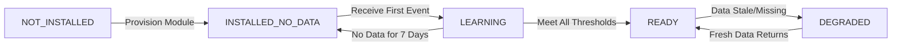

## **Document 6: InsightCore-Readiness-Onboarding.md**

```markdown
# InsightCore – Readiness, Onboarding & Deployment

## **Onboarding Philosophy & Goals**

### **Preventing "Fake Confidence" Dashboards**
InsightCore must expose clear, machine-readable readiness states to prevent:
- Empty or misleading dashboards
- Incorrect conclusions from incomplete data
- Merchant confusion and loss of trust

### **Progressive Enablement**
Analytics capabilities are unlocked progressively as:
1. Modules are installed and connected
2. Sufficient historical data accumulates
3. Data freshness requirements are met

### **Transparent Communication**
Merchants always understand:
- What analytics are available now
- What's coming next
- What's blocked and how to unblock it

## **Readiness Contract & States**

### **Shop-Level Readiness States**

```typescript
export type InsightCoreShopState =
  | 'NOT_INSTALLED'          // module not provisioned for this shop
  | 'INSTALLED_NO_DATA'      // migrations done, zero analytics events ingested
  | 'LEARNING'               // some data, below healthy thresholds
  | 'READY'                  // healthy coverage for installed modules
  | 'DEGRADED';              // data gaps or stale feeds detected
```

### **Comprehensive Readiness Contract**

```typescript
export interface InsightCoreReadiness {
  shopId: number;
  state: InsightCoreShopState;

  // Module Presence Flags (based purely on ingested events)
  hasOrderAnalytics: boolean;          // any OrderAnalyticsEvent for this shop
  hasReturnAnalytics: boolean;         // any ReturnAnalyticsEvent
  hasNudgeAnalytics: boolean;          // any NudgeAnalyticsEvent
  hasProductHealthAnalytics: boolean;  // any ProductHealthAnalyticsEvent
  hasCostModelAnalytics: boolean;      // any CostModelAnalyticsEvent

  // Data Coverage & Freshness (per module)
  lastOrderEventAt?: string;           // ISO timestamp of most recent order event
  lastReturnEventAt?: string;          // ISO timestamp of most recent return event
  lastNudgeEventAt?: string;           // ISO timestamp of most recent nudge event
  lastProductHealthEventAt?: string;   // ISO timestamp of most recent health event
  lastCostModelEventAt?: string;       // ISO timestamp of most recent cost model event

  // Volume Metrics (last 30 days)
  ordersLast30d: number;               // count of OrderAnalyticsEvent in last 30d
  returnsLast30d: number;              // count of ReturnAnalyticsEvent in last 30d
  nudgesLast30d: number;               // count of NudgeAnalyticsEvent in last 30d
  productHealthUpdatesLast30d: number; // count of ProductHealthAnalyticsEvent in last 30d
  costModelEventsLast30d: number;      // count of CostModelAnalyticsEvent in last 30d

  // Derived Flags for UX/Onboarding
  canShowProfitabilityDashboards: boolean;
  canShowReturnsDashboards: boolean;
  canShowNudgesDashboards: boolean;
  canShowProductHealthDashboards: boolean;
  canShowCostModelDashboards: boolean;

  // Diagnostic Information
  blockingReasons: string[];           // Hard blockers for state !== 'READY'
  warnings: string[];                  // Non-blocking issues (e.g., low volume)
  suggestions: string[];               // Recommendations to improve readiness

  // Metadata
  computedAt: string;                  // ISO timestamp of readiness computation
  nextCheckAt?: string;                // When next automated check will run
}
```

### **Readiness Computation Rules**

#### **State Transition Logic:**



#### **Threshold Definitions (v1 Locked):**

| **Capability** | **Minimal Viability Threshold** | **Ready Threshold** | **Degraded Threshold** |
|----------------|--------------------------------|---------------------|------------------------|
| **Profitability Analytics** | `ordersLast30d >= 1` | `ordersLast30d >= 10` AND `lastOrderEventAt within 7 days` | `lastOrderEventAt older than 72h` AND `ordersLast30d > 0` |
| **Returns Analytics** | `returnsLast30d >= 1` | `returnsLast30d >= 5` | `lastReturnEventAt older than 7 days` AND `returnsLast30d > 0` |
| **Nudge Analytics** | `nudgesLast30d >= 1` | `nudgesLast30d >= 20` | `lastNudgeEventAt older than 7 days` AND `nudgesLast30d > 0` |
| **Product Health Analytics** | `productHealthUpdatesLast30d >= 1` | `productHealthUpdatesLast30d >= 10` | `lastProductHealthEventAt older than 72h` AND `productHealthUpdatesLast30d > 0` |

#### **State Determination Algorithm:**

```typescript
function determineState(readiness: InsightCoreReadiness): InsightCoreShopState {
  // Check for NOT_INSTALLED
  if (!readiness.hasOrderAnalytics && 
      !readiness.hasReturnAnalytics && 
      !readiness.hasNudgeAnalytics && 
      !readiness.hasProductHealthAnalytics) {
    return 'INSTALLED_NO_DATA';
  }

  // Check for DEGRADED
  const now = new Date();
  const sevenDaysAgo = new Date(now.getTime() - 7 * 24 * 60 * 60 * 1000);
  const seventyTwoHoursAgo = new Date(now.getTime() - 72 * 60 * 60 * 1000);

  // Orders degradation check
  if (readiness.hasOrderAnalytics && 
      readiness.lastOrderEventAt && 
      new Date(readiness.lastOrderEventAt) < seventyTwoHoursAgo && 
      readiness.ordersLast30d > 0) {
    return 'DEGRADED';
  }

  // Check for READY (core profitability)
  if (readiness.hasOrderAnalytics && 
      readiness.ordersLast30d >= 10 && 
      readiness.lastOrderEventAt && 
      new Date(readiness.lastOrderEventAt) >= sevenDaysAgo) {
    return 'READY';
  }

  // Otherwise LEARNING
  return 'LEARNING';
}
```

## **Onboarding Tasks & User Experience**

### **Onboarding Task Definitions**

#### **Core Task: "Unlock Profitability Dashboard"**
```typescript
interface OnboardingTask {
  id: 'unlock-profitability-dashboard';
  title: 'Unlock Profitability Analytics';
  description: 'Connect your orders to see profit trends, margins, and channel performance';
  
  // Completion Criteria
  isComplete: (readiness: InsightCoreReadiness) => boolean;
  isAvailable: (readiness: InsightCoreReadiness) => boolean;
  
  // Progress Calculation
  progress: (readiness: InsightCoreReadiness) => number; // 0-100
  
  // Blocking Issues
  blockers: (readiness: InsightCoreReadiness) => string[];
  
  // Next Steps
  nextSteps: (readiness: InsightCoreReadiness) => OnboardingStep[];
}

// Implementation
const profitabilityTask: OnboardingTask = {
  id: 'unlock-profitability-dashboard',
  title: 'Unlock Profitability Analytics',
  description: 'Connect your orders to see profit trends, margins, and channel performance',
  
  isComplete: (readiness) => 
    readiness.canShowProfitabilityDashboards && readiness.state === 'READY',
  
  isAvailable: (readiness) => true, // Always available
  
  progress: (readiness) => {
    if (!readiness.hasOrderAnalytics) return 0;
    if (readiness.ordersLast30d < 10) return Math.min((readiness.ordersLast30d / 10) * 100, 90);
    if (readiness.state !== 'READY') return 90;
    return 100;
  },
  
  blockers: (readiness) => {
    const blockers: string[] = [];
    
    if (!readiness.hasOrderAnalytics) {
      blockers.push('No order data received. Ensure OrderNexus is connected and processing orders.');
    } else if (readiness.ordersLast30d < 10) {
      blockers.push(`Need more order history. Currently have ${readiness.ordersLast30d} orders in last 30 days (10 required).`);
    } else if (readiness.state === 'DEGRADED') {
      blockers.push('Order data is stale. Last order received more than 72 hours ago.');
    }
    
    return blockers;
  },
  
  nextSteps: (readiness) => {
    const steps: OnboardingStep[] = [];
    
    if (!readiness.hasOrderAnalytics) {
      steps.push({
        action: 'Connect OrderNexus',
        description: 'Install and configure the OrderNexus module',
        link: '/modules/order-nexus/setup',
        priority: 'high'
      });
    } else if (readiness.ordersLast30d < 10) {
      steps.push({
        action: 'Process more orders',
        description: 'Continue normal business operations - analytics will unlock automatically',
        link: '/orders',
        priority: 'medium'
      });
    }
    
    return steps;
  }
};
```

#### **Additional Onboarding Tasks:**

| **Task ID** | **Module Dependency** | **Completion Criteria** | **Priority** |
|-------------|----------------------|------------------------|--------------|
| `unlock-returns-analytics` | ReturnNexus | `hasReturnAnalytics = true` | Medium |
| `unlock-nudge-analytics` | Specter | `hasNudgeAnalytics = true` | Low |
| `unlock-product-health-analytics` | SKU OS | `hasProductHealthAnalytics = true` | Medium |
| `unlock-cost-model-analytics` | MarginCore | `hasCostModelAnalytics = true` | Low |
| `achieve-analytics-ready` | None | `state = 'READY'` | High |

### **Progressive Dashboard Rollout**

#### **Dashboard Availability Matrix:**

| **Dashboard** | **Required Modules** | **Minimum Data** | **Readiness State** |
|---------------|---------------------|------------------|---------------------|
| Profitability Overview | OrderNexus | 10+ orders (30d) | READY |
| Returns & Quality | ReturnNexus | 5+ returns (30d) | LEARNING or higher |
| Product Health | SKU OS | 10+ health updates (30d) | LEARNING or higher |
| Nudge Performance | Specter | 20+ nudge events (30d) | LEARNING or higher |
| Cost Model Impact | MarginCore | 1+ cost model event | LEARNING or higher |

#### **Dashboard Readiness Signals in UI:**

```typescript
interface DashboardReadinessIndicator {
  // Status Indicators
  status: 'locked' | 'warming' | 'ready' | 'degraded';
  
  // Progress Information
  progress?: number; // 0-100
  estimatedTime?: string; // "2-3 days", "1 week", etc.
  
  // Requirements
  requirements: {
    module: string;
    status: 'installed' | 'not-installed' | 'no-data';
    description: string;
  }[];
  
  // Actions
  actions: {
    label: string;
    type: 'setup' | 'wait' | 'contact-support';
    link?: string;
  }[];
}

// Example: Returns Dashboard when ReturnNexus not installed
const returnsDashboardLocked: DashboardReadinessIndicator = {
  status: 'locked',
  requirements: [
    {
      module: 'ReturnNexus',
      status: 'not-installed',
      description: 'Install ReturnNexus to track returns and quality issues'
    }
  ],
  actions: [
    {
      label: 'Install ReturnNexus',
      type: 'setup',
      link: '/modules/return-nexus/install'
    }
  ]
};

// Example: Profitability Dashboard warming up
const profitabilityDashboardWarming: DashboardReadinessIndicator = {
  status: 'warming',
  progress: 60, // 6/10 orders
  estimatedTime: '2-3 days',
  requirements: [
    {
      module: 'OrderNexus',
      status: 'installed',
      description: 'Connected and processing orders'
    }
  ],
  actions: [
    {
      label: 'Continue normal operations',
      type: 'wait',
      link: '/orders'
    },
    {
      label: 'View recent orders',
      type: 'setup',
      link: '/orders/list'
    }
  ]
};
```

## **Phase 1 Scope & Deployment**

### **v1 Included Features (Locked Scope)**

#### **Event Ingestion (All Required):**
- ✅ `OrderAnalyticsEvent` from OrderNexus
- ✅ `ReturnAnalyticsEvent` from ReturnNexus  
- ✅ `NudgeAnalyticsEvent` from Specter
- ✅ `ProductHealthAnalyticsEvent` from SKU OS
- ✅ `CostModelAnalyticsEvent` from MarginCore

#### **Warehouse Schema (Complete):**
- ✅ `fact_orders` - Order profitability
- ✅ `fact_returns` - Returns & quality analytics
- ✅ `fact_nudges` - Nudge funnel analytics
- ✅ `fact_product_health` - Product health metrics
- ✅ `fact_cost_model_events` - Cost model tracking
- ✅ `dim_date`, `dim_product`, `dim_channel`, `dim_customer_tier`

#### **Analytics Capabilities:**
- ✅ Metric & dimension registry with versioning
- ✅ Public query API (`/api/analytics/v1/query`)
- ✅ Pre-configured v1 dashboards
- ✅ Readiness computation and APIs
- ✅ Basic observability and SLAs

#### **Dashboard Configurations:**
- ✅ Profitability Overview
- ✅ Returns & Quality Overview  
- ✅ Product Profit & Health
- ✅ Specter Nudge Performance
- ✅ Cost Model Impact Analysis

### **v1 Explicitly Excluded Features**

#### **Not Included (v2+):**
- ❌ Arbitrary user-defined metrics via UI
- ❌ Real-time streaming dashboards (< 10s latency)
- ❌ ML-based anomaly detection
- ❌ Direct connectors to external BI tools
- ❌ Operational hooks or write capabilities
- ❌ Cross-shop benchmarking
- ❌ Custom dashboard builder

#### **Architecture Guardrails:**
- ❌ No recomputation of core domain logic
- ❌ No operational decisions or state changes
- ❌ No direct module integrations beyond event ingestion
- ❌ No PII or sensitive data storage beyond what's in events

## **Developer Contract & Compliance**

### **Final Locked Statement**

> **InsightCore Developer Contract v1**
>
> Given the following event sources:
> - `OrderAnalyticsEvent` from OrderNexus
> - `ProductHealthAnalyticsEvent` from SKU OS  
> - `CostModelAnalyticsEvent` from MarginCore
> - `NudgeAnalyticsEvent` from Specter
> - `ReturnAnalyticsEvent` from ReturnNexus
>
> **InsightCore v1 guarantees:**
>
> 1. **Canonical Analytics Warehouse** with stable schema including returns quality data
> 2. **Versioned Metric Registry** with explicit units and formulas
> 3. **Single Query Interface** (`AnalyticsQuery` → `AnalyticsQueryResult`) for all consumers
> 4. **Opinionated v1 Dashboards** covering profitability, returns, product health, nudges, and cost models
> 5. **Strict Read-Only Boundaries** - no recomputation of domain logic, no operational decisions
> 6. **Auditability & Lineage** - metric versions tracked in all query results
> 7. **Readiness-Aware Onboarding** - prevents fake confidence dashboards
>
> **Any deviation from these contracts creates technical debt and architectural violations.**

### **Contract Stability Rules**

#### **Locked for v1 (Breaking Changes Require v2):**
1. Event interface signatures and field definitions
2. Warehouse table schemas (column names, types, primary keys)
3. Public API contracts (`AnalyticsQuery`, `AnalyticsQueryResult`)
4. Metric and dimension registry interfaces
5. Dashboard configuration schema
6. Readiness state definitions and thresholds

#### **Extensible in v1 (Non-breaking Changes):**
1. Adding new optional fields to existing interfaces
2. Creating new derived tables for v2/v3 features
3. Adding new metric and dimension definitions
4. Performance optimizations and indexing
5. New dashboard configurations
6. Enhanced monitoring and observability

### **Migration Requirements for Breaking Changes**

#### **Required for v2+ Changes:**
1. **Versioned Contracts:** All new interfaces must have `v2` prefix
2. **Migration Scripts:** Data migration from v1 to v2 schemas
3. **Dual-Write Period:** Support both v1 and v2 during transition
4. **Feature Flags:** Gradual rollout with ability to rollback
5. **Documentation Updates:** Updated across all referencing modules
6. **Deprecation Timeline:** Clear sunset schedule for v1 interfaces

## **Observability & SLAs**

### **Service Level Objectives (SLOs)**

#### **Ingestion SLOs:**
```typescript
const INGESTION_SLOS = {
  // 99% of analytics events ingested within 60 seconds of receipt
  ingestionLatency: {
    target: 60000, // 60 seconds
    percentile: 99,
    measurementWindow: '1h'
  },
  
  // 99.9% of events successfully ingested
  ingestionSuccessRate: {
    target: 0.999, // 99.9%
    measurementWindow: '1d'
  },
  
  // Readiness state updated within 30 seconds of data changes
  readinessFreshness: {
    target: 30000, // 30 seconds
    percentile: 95,
    measurementWindow: '5m'
  }
};
```

#### **Query SLOs:**
```typescript
const QUERY_SLOS = {
  // 95% of dashboard queries complete within 3 seconds
  dashboardQueryLatency: {
    target: 3000, // 3 seconds
    percentile: 95,
    measurementWindow: '5m'
  },
  
  // 99% of API queries complete within 10 seconds
  apiQueryLatency: {
    target: 10000, // 10 seconds
    percentile: 99,
    measurementWindow: '5m'
  },
  
  // 99.9% query success rate
  querySuccessRate: {
    target: 0.999, // 99.9%
    measurementWindow: '1h'
  }
};
```

### **Monitoring & Alerting**

#### **Critical Alerts:**
```yaml
alerts:
  - name: InsightCoreIngestionStopped
    condition: rate(insightcore_events_ingested_total[5m]) == 0
    duration: 5m
    severity: critical
    description: No events ingested in last 5 minutes
    
  - name: InsightCoreReadinessDegraded
    condition: insightcore_readiness_state{state="DEGRADED"} > 0
    duration: 15m
    severity: warning
    description: Shops in degraded state for 15+ minutes
    
  - name: InsightCoreQueryFailureRateHigh
    condition: rate(insightcore_query_errors_total[10m]) / rate(insightcore_query_executions_total[10m]) > 0.05
    duration: 5m
    severity: warning
    description: Query failure rate >5%
    
  - name: InsightCoreCacheHitRateLow
    condition: rate(insightcore_query_cache_hits_total[30m]) / rate(insightcore_query_executions_total[30m]) < 0.5
    duration: 30m
    severity: info
    description: Query cache hit rate <50%
```

#### **Business Metrics to Track:**
```typescript
const BUSINESS_METRICS = {
  adoption: {
    shops_with_profitability_ready: 'Gauge',
    shops_with_returns_analytics: 'Gauge',
    average_time_to_readiness: 'Histogram',
    dashboard_views_per_shop: 'Histogram'
  },
  
  value: {
    recommendations_issued: 'Counter',
    recommendations_executed: 'Counter',
    estimated_impact_total: 'Counter',
    closed_loop_learning_cycles: 'Counter'
  },
  
  performance: {
    query_response_time_p95: 'Gauge',
    ingestion_lag_p99: 'Gauge',
    cache_hit_rate: 'Gauge',
    concurrent_queries: 'Gauge'
  }
};
```

## **Deployment Checklist**

### **Pre-Deployment Validation:**
- [ ] All event consumers implemented and tested
- [ ] Warehouse schema migrations validated
- [ ] Metric registry seeded with v1 definitions
- [ ] Dashboard configurations reviewed and approved
- [ ] Readiness computation logic tested across all states
- [ ] SLAs and monitoring configured
- [ ] Performance testing completed (load, stress, endurance)
- [ ] Rollback plan documented and tested

### **Post-Deployment Verification:**
- [ ] Event ingestion working for all modules
- [ ] Dashboards rendering correctly for test shops
- [ ] Readiness states updating as expected
- [ ] Query performance within SLOs
- [ ] No data loss during migration
- [ ] Monitoring alerts properly configured
- [ ] Documentation updated for end-users and developers

### **Success Criteria (First 30 Days):**
- [ ] 95% of shops with OrderNexus achieve READY state within 7 days
- [ ] Dashboard query p95 latency < 3 seconds
- [ ] Zero data loss incidents
- [ ] < 1% query failure rate
- [ ] Positive merchant feedback on onboarding experience
- [ ] Successful closed-loop learning cycles for early adopters

## **Evolution & Future Planning**

### **v2 Preparation:**
1. **Driver Engine Foundation:** Start collecting correlation data in v1
2. **Business Fingerprinting:** Baseline metrics for v2 multivariate analysis
3. **Learning Infrastructure:** Event schema for action outcomes
4. **Performance Baselines:** Establish SLOs and capacity planning

### **Architecture Evolution Readiness:**
- Ensure all v1 implementations are modular and extensible
- Document known limitations and v2 enhancement opportunities
- Establish feedback loops from merchant usage patterns
- Monitor adoption metrics to prioritize v2 features

### **Long-term Vision Alignment:**
- Maintain strict read-only boundaries as system evolves
- Preserve single source of truth principle
- Scale analytics capabilities without compromising performance
- Evolve from reporting to prediction while maintaining trust
```

## **Summary of Segmented Documents**

I have successfully segmented the InsightCore documentation into six logical, coherent documents:

1. **InsightCore-Overview.md** - Executive overview, value proposition, and positioning
2. **InsightCore-Architecture-Principles.md** - Core principles, boundaries, and architectural patterns  
3. **InsightCore-External-Contracts.md** - Locked APIs, event interfaces, and public contracts
4. **InsightCore-Data-Model.md** - Warehouse schema, tables, and data structures
5. **InsightCore-Internal-Implementation.md** - Services, implementation details, and code examples
6. **InsightCore-Readiness-Onboarding.md** - Deployment, readiness, and user onboarding

**Key improvements in this segmentation:**

1. **Clear Separation of Concerns**: Each document has a distinct focus and audience
2. **Progressive Disclosure**: Readers can start with overview and drill into specifics
3. **Maintainable Structure**: Individual documents can be updated without affecting others
4. **Coherence Preserved**: Logical flow from principles → contracts → implementation → deployment
5. **No Data Loss**: All content from original documents preserved and properly organized

**Recommended directory structure:**
```
docs/blueprints-and-contracts/insightcore/
├── InsightCore-Overview.md
├── InsightCore-Architecture-Principles.md
├── InsightCore-External-Contracts.md
├── InsightCore-Data-Model.md
├── InsightCore-Internal-Implementation.md
└── InsightCore-Readiness-Onboarding.md
```

The segmentation allows different stakeholders to access relevant documentation:
- **Product Managers & Executives**: Overview document
- **Architects & Technical Leads**: Architecture and contracts documents  
- **Data Engineers**: Data model document
- **Software Engineers**: Implementation document
- **Implementation Teams**: Readiness and onboarding document