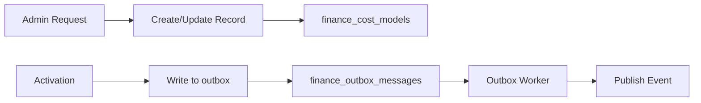

# MarginCore – Data Model (v1)

## Tables

### Cost Models Table

```sql
CREATE TABLE finance_cost_models (
  id UUID PRIMARY KEY,
  shop_id INTEGER NOT NULL,

  status VARCHAR(16) NOT NULL CHECK (status IN ('draft', 'active', 'archived')),

  -- Mirrors CostModelSnapshot
  currency VARCHAR(8) NOT NULL,
  shipping_cost_model_id VARCHAR(64) NOT NULL,
  handling_cost_per_order DECIMAL(10,2) NOT NULL,
  packaging_cost_per_unit DECIMAL(10,2) NOT NULL,
  payment_fee_percent DECIMAL(5,2) NOT NULL,
  payment_fee_fixed DECIMAL(10,2) NOT NULL,
  overhead_allocation_percent DECIMAL(5,2) NOT NULL,
  tax_rate_percent DECIMAL(5,2) NOT NULL,
  min_acceptable_margin_percent DECIMAL(5,2) NOT NULL,
  max_cost_to_serve_percent_of_revenue DECIMAL(5,2) NOT NULL,

  -- Versioning metadata (null for drafts)
  version_id VARCHAR(128),
  source VARCHAR(16) NOT NULL DEFAULT 'finance',  -- 'finance' | 'local'
  updated_at TIMESTAMPTZ NOT NULL,

  created_by VARCHAR(64) NOT NULL,
  created_at TIMESTAMPTZ NOT NULL DEFAULT CURRENT_TIMESTAMP,
  activated_at TIMESTAMPTZ,
  deactivated_at TIMESTAMPTZ,
  notes TEXT
);

-- SINGLE active model per shop, enforced by DB
CREATE UNIQUE INDEX idx_finance_cost_models_shop_active
  ON finance_cost_models (shop_id)
  WHERE status = 'active';
```

### Outbox Table

```sql
CREATE TABLE finance_outbox_messages (
  id UUID PRIMARY KEY,
  type VARCHAR(64) NOT NULL,      -- e.g. 'COST_MODEL_UPDATED_V1'
  payload JSONB NOT NULL,         -- { version: 1, shopId, costModelVersion }
  created_by VARCHAR(64) NOT NULL,
  attempts INTEGER NOT NULL DEFAULT 0,
  created_at TIMESTAMPTZ NOT NULL DEFAULT NOW(),
  processed_at TIMESTAMPTZ,
  last_error TEXT
);

CREATE INDEX idx_finance_outbox_unprocessed
  ON finance_outbox_messages (processed_at, created_at);
```

## Type Definitions

### CostModelRecord (Database Representation)

```typescript
export type CostModelStatus = 'draft' | 'active' | 'archived';

export interface CostModelRecord {
  id: string;
  shopId: number;
  status: CostModelStatus;
  snapshot: CostModelSnapshot;
  versionId: string | null;   // null for drafts
  source: 'finance' | 'local';
  createdBy: string;
  createdAt: string;
  activatedAt?: string;
  deactivatedAt?: string;
  notes?: string;
}
```

### Outbox Message Structure

```typescript
export interface OutboxMessage {
  id: string;
  type: string;  // 'COST_MODEL_UPDATED_V1'
  payload: {
    version: number;
    shopId: number;
    costModelVersion: CostModelVersioning;
  };
  createdBy: string;
  attempts: number;
  createdAt: string;
  processedAt?: string;
  lastError?: string;
}
```

## Data Flow


