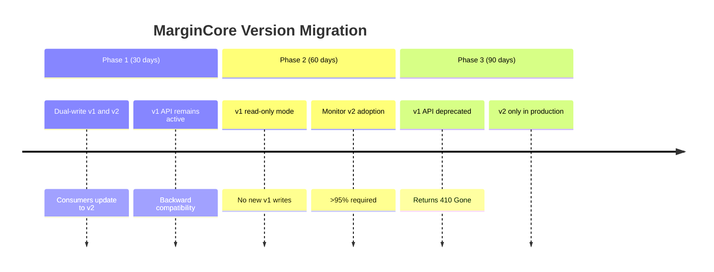

# MarginCore – Observability & v1 Scope

## Observability & Metrics

### Required Metrics
MarginCore must expose the following metrics to ensure system health and operational visibility:

```yaml
finance:
  cost_models:
    active_models_per_shop: gauge        # Should be 0 or 1
    drafts_per_shop: gauge               # Number of draft models
    fetch_latency_ms: histogram          # Cost model fetch latency
    validation_failures_total: counter   # Cost model validation failures
    
  recomputation:
    updates_total: counter               # Total cost model updates
    updates_with_all_orders_since: counter # Updates requiring historical recomputation
    simulations_run: counter             # Simulation runs (optional)
    guardrail_violations_total: counter  # Recomputation guardrail violations
    
  outbox:
    messages_pending: gauge              # Pending outbox messages
    messages_failed: counter             # Failed message deliveries
    publish_latency_ms: histogram        # Outbox publish latency
    retries_total: counter               # Total retry attempts
    
  api:
    requests_total: counter              # Total API requests
    request_duration_ms: histogram       # API endpoint latency
    errors_total: counter                # API errors by endpoint and code
```

### Alerting Rules

**Critical Alerts (P0):**
- `finance_outbox_messages_pending > 1000` for 5 minutes
- `finance_cost_models_active_models_per_shop > 1` (data corruption)
- `finance_api_errors_total` rate increase > 10x

**Warning Alerts (P1):**
- `finance_outbox_messages_failed > 10` in 1 hour
- `finance_cost_model_fetch_latency_ms_p99 > 1000ms`
- `finance_recomputation_guardrail_violations_total > 5` in 24 hours

### Logging Structure

```json
{
  "timestamp": "2025-01-10T12:00:00Z",
  "level": "INFO",
  "service": "margin-core",
  "component": "CostModelManagementService",
  "event": "FINANCE_COST_MODEL_ACTIVATED",
  "shopId": 12345,
  "costModelId": "550e8400-e29b-41d4-a716-446655440000",
  "versionId": "finance:2025-01-10T12:00:00Z",
  "recomputationScope": "all_orders_since",
  "userId": "user@example.com",
  "traceId": "abc123def456",
  "durationMs": 145
}
```

**Key Events to Log:**
- `FINANCE_COST_MODEL_DRAFT_CREATED`
- `FINANCE_COST_MODEL_ACTIVATED`
- `FINANCE_COST_MODEL_VALIDATION_FAILED`
- `FINANCE_RECOMPUTATION_GUARDRAIL_TRIGGERED`
- `FINANCE_OUTBOX_MESSAGE_PUBLISHED`
- `FINANCE_OUTBOX_MESSAGE_FAILED`

## Phase 1 Scope (v1 – Locked)

### ✅ Included Features (v1)

#### Core Functionality
1. **Single-currency cost models** per shop
   - No foreign exchange (FX) handling
   - Assumes all transactions in shop's primary currency

2. **Complete `CostModelSnapshot` implementation**
   - Shipping cost model references
   - Handling, packaging, payment fees
   - Overhead allocation and tax rates
   - Margin thresholds and cost-to-serve limits

3. **Cost model lifecycle management**
   - Draft → Active → Archived states
   - Single active model per shop (enforced at DB level)
   - Full audit trail with creation/activation times

4. **`FinanceClient.getCostModel` service**
   - Low-latency read path (< 10ms p99)
   - Redis caching with 5-minute TTL
   - Cache-aside pattern with graceful degradation

5. **Event-driven updates**
   - Outbox pattern for reliable `CostModelUpdatedEvent` publishing
   - Idempotent message processing
   - At-least-once delivery semantics

6. **Recomputation guardrails**
   - Configurable maximum window (30-90 days)
   - Daily recomputation quota per shop
   - Order count estimation from analytics

7. **Role-based access control**
   - `ROLE_FINANCE_ADMIN` for shop-level operations
   - `ROLE_PLATFORM_ADMIN` for high-impact operations
   - Middleware integration with auth system

8. **Validation and constraints**
   - Business rule validation (0-100% ranges, non-negative costs)
   - Database constraints (unique active model, status checks)
   - Input sanitization and type safety

#### Optional but Recommended
9. **Simulation service**
   - Internal endpoint to simulate cost model impact
   - Uses last N days of order data via OrderNexus
   - Returns margin impact analysis without persistence

### ❌ Explicitly Excluded (Future Versions)

#### Currency & Localization
1. **Multi-currency support**
   - FX rate management
   - Cross-currency cost calculations
   - Localized tax rate handling

#### Advanced Modeling
2. **Channel-specific cost models**
   - Per-marketplace (Amazon, Shopify, etc.) variations
   - Regional shipping cost differences
   - Platform-specific fee structures

3. **Time-based cost models**
   - Seasonal pricing adjustments
   - Promotional period configurations
   - Scheduled model activations

#### User Experience
4. **Administrative dashboards**
   - UI for cost model management (Analytics Core responsibility)
   - Visual comparison tools
   - Historical trend analysis

5. **Advanced planning tools**
   - "What-if" scenario engine
   - Multiple model comparison
   - Predictive margin forecasting

#### Integration Features
6. **Bulk operations**
   - Mass model activation across shops
   - Template-based model creation
   - Batch validation and simulation

7. **Advanced guardrails**
   - Machine learning-based impact prediction
   - Dynamic quota adjustment
   - Cross-shop dependency analysis

## Versioning Policy

### Breaking Changes
Any change to locked interfaces (`CostModelSnapshot`, `CostModelVersioning`, `FinanceClient`) requires:
1. New versioned contract (`v2`, `v3`, etc.)
2. Migration plan with backward compatibility window
3. Dual-running capability during migration
4. Updated consumer integration tests

### Non-breaking Changes
The following can be added without version increment:
- New internal API endpoints
- Additional validation rules
- Enhanced logging and metrics
- Performance optimizations
- Database index additions

### Deprecation Schedule
1. **Announcement**: 30 days before deprecation
2. **Support period**: 90 days with warnings
3. **Removal**: After 120 days with migration tooling

## Migration Strategy for v1 → v2



## Success Criteria (v1 Launch)

### Functional Requirements
- [ ] 100% of cost model CRUD operations working
- [ ] Active model uniqueness enforced at DB level
- [ ] Event publishing reliability > 99.9%
- [ ] Cache hit rate > 95% for `getCostModel`

### Performance Requirements
- [ ] `getCostModel` p99 latency < 10ms
- [ ] Model activation transaction < 100ms
- [ ] Outbox processing lag < 1 minute
- [ ] API error rate < 0.1%

### Operational Requirements
- [ ] Comprehensive metrics dashboard
- [ ] Alerting configured for critical issues
- [ ] Disaster recovery procedure documented
- [ ] Load testing completed (10x expected load)

### Quality Requirements
- [ ] Unit test coverage > 85%
- [ ] Integration test coverage > 70%
- [ ] End-to-end test suite for critical paths
- [ ] Documentation complete and reviewed
```