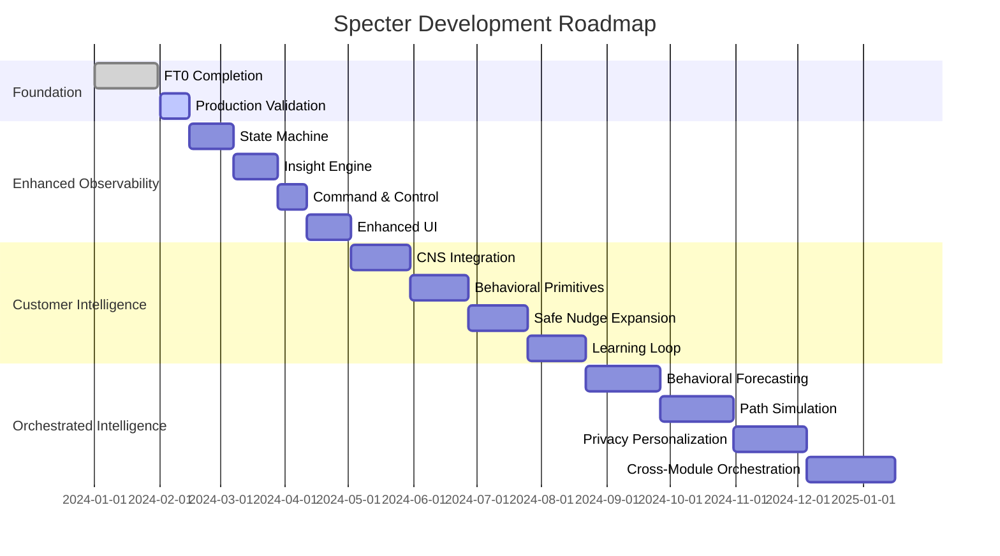

# Specter: Development Roadmap

## Overview

This roadmap outlines the phased development of Specter, from the current FT0 foundation through future intelligence enhancements. The plan balances immediate operational needs with long-term strategic vision, ensuring each phase delivers tangible value while maintaining architectural integrity.

## Phase Strategy

### Guiding Principles
1. **Incremental Value**: Each phase delivers usable functionality
2. **Backward Compatibility**: New features don't break existing contracts
3. **Privacy First**: PCD compliance maintained throughout
4. **Operational Stability**: Production reliability prioritized

---

## Phase 0: Foundation (FT0 - Current)

**Status**: ✅ Implementation Complete, ✅ Testing Complete, 🟡 Production Validation Pending

### Objectives
- Establish reliable stateful observability foundation
- Enable basic session and event tracking
- Create testable, production-ready infrastructure

### Key Deliverables
| **Component** | **Status** | **Description** |
|---------------|------------|-----------------|
| Redis-backed Session Store | ✅ Complete | Production store with in-memory fallback |
| Ingestion Worker | ✅ Complete | Queue consumption and best-effort writes |
| Basic API Surface | ✅ Complete | State endpoint and config management |
| Integration Hooks | ✅ Complete | Canonical ingestion and sync orchestration |
| Testing Framework | ✅ Complete | Unit and integration test coverage |

### Technical Foundation
- **Data Models**: AnonymousSession, SpecterEvent, ShopConfig
- **Storage**: Redis lists with bounded lengths, PostgreSQL for configs
- **API**: REST endpoints with Bearer token auth
- **Integration**: Non-blocking hooks in core flows

### Remaining FT0 Tasks
1. **Redis End-to-End Validation** - Confirm production Redis usage
2. **Config Cache Completion** - Finalize get/updateShopConfig methods
3. **Enhanced Test Coverage** - Add Redis-specific validation tests

### Success Metrics
- [x] Redis store initialized and used in runtime
- [x] `GET /api/v1/specter/:shopId/state` returns complete shop state
- [x] Canonical ingestion and sync workers call Specter hooks
- [x] Full unit & integration test coverage
- [x] Minimal verification UI available
- [ ] Production smoke test with real Redis + queue

---

## Phase 1: Enhanced Observability (FT1)

**Timeline**: Next 4-8 weeks
**Focus**: From passive tracking to active insights

### Objectives
1. Add state machine for shop health tracking
2. Implement basic insight/alerting engine
3. Enhance config enforcement capabilities
4. Add command/control features

### Feature Breakdown

#### 1. State Machine
```typescript
type ShopState = 
  | 'IDLE'          // No active sync/ingestion
  | 'INGESTING'     // Active canonical ingestion
  | 'SYNCING'       // Platform sync in progress
  | 'HEALTHY'       // Regular successful operations
  | 'WARNING'       // Degraded but functional
  | 'ERROR';        // Critical failure state
```

**Implementation Plan**:

- State transitions driven by event patterns
- State persistence in Redis (`specter:shop:{id}:state`)
- Timeout-based state regression (e.g., HEALTHY → IDLE after inactivity)
- State change events added to ledger

#### 2. Insight Engine

```typescript
interface Insight {
  id: string;
  shopId: number;
  type: 'STALE_INGESTION' | 'EXCESSIVE_RETRIES' | 'MISSING_DATA';
  severity: 'INFO' | 'WARNING' | 'CRITICAL';
  message: string;
  evidence: SpecterEvent[];
  createdAt: string;
  resolvedAt?: string;
}
```

**Rules Engine**:

- Periodic evaluation (every 5 minutes)
- Configurable thresholds per shop
- Insight storage in Redis list (`specter:shop:{id}:insights`)
- Basic alerting via existing notification systems

#### 3. Config Enforcement

- Runtime validation of shop configurations
- Worker pre-flight checks against config rules
- Graceful degradation when configs invalid
- Admin override capabilities

#### 4. Command & Control

```typescript
interface SpecterCommand {
  type: 'RESYNC' | 'CLEAR_SESSION' | 'PAUSE_INGESTION';
  shopId: number;
  parameters?: Record<string, any>;
  issuedBy: string; // User/System identifier
  deadline?: string;
}
```

**API Additions**:

- `POST /api/v1/specter/:shopId/commands` - Issue commands
- `GET /api/v1/specter/:shopId/commands` - Command history
- Queue integration for async command execution

#### 5. Enhanced UI

- Shop health dashboard with state timeline
- Insights list with filtering and resolution
- Command issuance interface
- Config editor with validation

### Phase 1 Technical Enhancements

| **Area** | **Enhancement** | **Benefit** |
|----------|-----------------|-------------|
| **Redis** | Streams for event ingestion | Better ordering and consumer groups |
| **API** | WebSocket for real-time updates | Live state and insight updates |
| **Metrics** | Prometheus endpoint | Operational monitoring |
| **Caching** | Multi-level cache strategy | Reduced Redis load |

### Dependencies

- ✅ FT0 foundation complete
- 🔄 Design approval for state machine UI
- 🔄 Operations team training for new features

---

## Phase 2: Customer Intelligence (v2)

**Timeline**: 3-6 months after FT1
**Focus**: From operational observability to behavioral intelligence

### Strategic Shift

- **From**: "What's happening with sync/ingestion?"
- **To**: "What's happening with customer behavior and how can we influence it safely?"

### Core Intelligence Layer

#### 1. Enhanced Customer Signals

```typescript
interface EnhancedCustomerSignal extends SpecterCustomerSignal {
  dataSources: {
    orderNexus: boolean;  // Profitability data
    skuOs: boolean;       // Inventory/risk data
    finance: boolean;     // Cost/margin data
  };
  confidence: 'low' | 'medium' | 'high';
  behavioralFingerprint: BehavioralVector;
  predictedBehaviors: {
    nextPurchaseWindow?: DateRange;
    likelyCategories?: string[];
    churnRiskReason?: string;
  };
}
```

#### 2. CNS Integration Contracts

- **OrderNexus**: Customer profitability aggregation (no PII)
- **SKU OS**: Inventory risk and replenishment signals
- **Financial Intelligence**: Margin safety boundaries
- **InsightCore**: Behavioral driver contributions

#### 3. Behavioral Primitives System

| **Primitive** | **Calculation** | **CNS Usage** |
|---------------|-----------------|---------------|
| `exit_intent_rate` | exit_intent_count / session_count | Conversion optimization |
| `page_engagement_score` | (time_on_page × interactions) / visits | Content effectiveness |
| `behavioral_volatility` | Session pattern variance over time | Anomaly detection |
| `cohort_fingerprint` | Normalized behavior vector | Customer segmentation |

#### 4. Safe Nudge Expansion

- **REMINDER+**: Contextual reminders with timing optimization
- **INFORMATION**: Educational nudges based on behavior patterns
- **SOCIAL_PROOF**: Aggregated social signals (no individual data)
- **All nudges maintain**: No discounts, margin safety, PCD compliance

#### 5. Learning Loop

```typescript
interface NudgeOutcomeAnalysis {
  nudgeType: string;
  impressionCount: number;
  conversionLift: number;
  marginImpact: number;
  confidenceInterval: [number, number];
  recommendations: {
    continue: boolean;
    adjustments?: NudgeAdjustment[];
    newExperiments?: ExperimentProposal[];
  };
}
```

### Phase 2 Technical Architecture

- **Data Pipeline**: Event streaming with real-time aggregation
- **Model Serving**: Lightweight ML models for behavior prediction
- **Experiment Framework**: A/B testing infrastructure
- **Privacy Layer**: Differential privacy and aggregation guarantees

### Success Criteria

- [ ] Behavioral primitives consumed by 2+ other CNS modules
- [ ] 10%+ conversion lift on implemented nudges (measured)
- [ ] Zero PCD violations in production
- [ ] Sub-100ms latency maintained with enhanced intelligence

---

## Phase 3: Orchestrated Intelligence (v3)

**Timeline**: 6-12 months after v2
**Focus**: From reactive intelligence to predictive orchestration

### Vision

Specter becomes the **customer behavior brain** of CNS, predicting and influencing customer journeys while maintaining strict privacy and margin safety.

### Advanced Capabilities

#### 1. Behavioral Forecasting

```typescript
interface BehavioralForecast {
  timeframe: '24h' | '7d' | '30d';
  predictions: {
    expectedSessions: number;
    expectedExitIntents: number;
    highOpportunityPages: Array<{
      page: string;
      probability: number;
      expectedLift: number;
    }>;
    riskFactors: Array<{
      type: 'engagement_drop' | 'category_shift' | 'cohort_change';
      severity: number;
      timeframe: string;
    }>;
  };
  confidence: number;
  lastUpdated: string;
}
```

#### 2. Path Simulation Engine

"What-if" analysis for behavioral interventions:

- Simulate impact of different nudge strategies
- Predict cascade effects across customer journey
- Margin safety validation before execution

#### 3. Privacy-Preserving Personalization

- Cohort-based recommendations (never individual)
- Federated learning approaches
- Secure multi-party computation for cross-shop insights
- Zero-knowledge proof of compliance

#### 4. Cross-Module Orchestration

```typescript
interface OrchestrationPlan {
  customerJourneyStage: 'AWARENESS' | 'CONSIDERATION' | 'CONVERSION' | 'RETENTION';
  recommendedActions: Array<{
    module: 'Specter' | 'OrderNexus' | 'SKU_OS' | 'ChannelModule';
    action: string;
    timing: 'IMMEDIATE' | 'WITHIN_24H' | 'NEXT_VISIT';
    expectedImpact: number;
    priority: number;
  }>;
  constraints: {
    marginSafety: number;
    privacyCompliance: boolean;
    operationalCapacity: boolean;
  };
}
```

#### 5. Advanced Experimentation

- Multi-arm bandit optimization
- Contextual bandits for personalization
- Bayesian optimization for parameter tuning
- Automatic experiment scaling based on significance

### Phase 3 Technical Foundation

- **Real-time Inference**: Sub-50ms prediction serving
- **Model Management**: Versioning, A/B testing, rollback
- **Observability**: Full traceability from prediction to outcome
- **Governance**: Automated compliance checking and reporting

### Strategic Outcomes

1. **10-15%** overall conversion rate improvement
2. **Predictive** rather than reactive customer engagement
3. **Seamless** orchestration across CNS modules
4. **Industry-leading** privacy-preserving personalization

---

## Cross-Phase Themes

### Privacy & Compliance

| **Phase** | **Focus** | **Mechanisms** |
|-----------|-----------|----------------|
| FT0 | Basic PCD safety | URL stripping, no customerId persistence |
| FT1 | Audit trails | Command logging, state change tracking |
| v2 | Aggregated intelligence | Cohort analysis, differential privacy |
| v3 | Advanced privacy | Federated learning, zero-knowledge proofs |

### Performance & Scalability

| **Phase** | **Latency Target** | **Scale Target** |
|-----------|-------------------|------------------|
| FT0 | < 100ms (nudge decisions) | 1k shops, 100 events/sec |
| FT1 | < 50ms (state checks) | 10k shops, 1k events/sec |
| v2 | < 100ms (intelligence) | 100k shops, 10k events/sec |
| v3 | < 50ms (predictions) | 1M shops, 100k events/sec |

### Integration Evolution

| **Phase** | **Integration Level** | **Key Partners** |
|-----------|----------------------|------------------|
| FT0 | Basic hooks | Canonical ingestion, sync orchestrator |
| FT1 | Operational feedback | Alerting systems, admin UI |
| v2 | CNS intelligence | OrderNexus, SKU OS, InsightCore |
| v3 | Full orchestration | All CNS modules, channel executors |

---

## Risk Mitigation Strategy

### Technical Risks

| **Risk** | **Phase** | **Mitigation** |
|----------|-----------|----------------|
| Redis scalability | FT0-FT1 | Sharding strategy, cache optimization |
| Latency budget breaches | All | Fallback patterns, circuit breakers |
| Data consistency | FT1 | Eventual consistency model, reconciliation jobs |
| Model drift | v2-v3 | Continuous monitoring, automatic retraining |

### Business Risks

| **Risk** | **Phase** | **Mitigation** |
|----------|-----------|----------------|
| Margin erosion | All | No discounts in v1, strict controls later |
| Privacy violations | All | Automated compliance checks, regular audits |
| Adoption barriers | FT1 | Gradual feature rollout, extensive documentation |
| Cognitive overload | v2-v3 | Smart defaults, automated recommendations |

### Operational Risks

| **Risk** | **Phase** | **Mitigation** |
|----------|-----------|----------------|
| Monitoring gaps | FT0-FT1 | Comprehensive metrics from day one |
| Incident response | All | Playbooks for common failure modes |
| Knowledge silos | All | Cross-team training, detailed runbooks |
| Technical debt | All | Regular architecture reviews, refactoring sprints |

---

## Success Metrics by Phase

### FT0 Success Metrics

- [ ] 99.9% uptime of Specter endpoints
- [ ] < 100ms P95 latency for nudge recommendations
- [ ] Zero production incidents related to PCD violations
- [ ] 100% test coverage of critical paths
- [ ] Successful onboarding of 10+ pilot shops

### FT1 Success Metrics

- [ ] 50% reduction in time-to-detect sync issues
- [ ] 30% reduction in manual intervention for common problems
- [ ] 95% accuracy in state machine transitions
- [ ] < 5% false positive rate for insights
- [ ] Adoption by 80% of operations team

### v2 Success Metrics

- [ ] 10%+ conversion lift from implemented nudges
- [ ] Behavioral primitives used by 3+ CNS modules
- [ ] < 1% margin impact from nudge recommendations
- [ ] 90%+ customer satisfaction with nudge relevance
- [ ] Successful integration with OrderNexus and SKU OS

### v3 Success Metrics

- [ ] 15%+ overall conversion rate improvement
- [ ] 80%+ prediction accuracy for behavioral forecasts
- [ ] 50% reduction in manual experiment setup
- [ ] Industry recognition for privacy-preserving innovation
- [ ] Successful orchestration of 5+ CNS modules

---

## Implementation Timeline



---

## Getting Involved

### For Developers

1. **FT0 Completion**: Help with Redis validation and test coverage
2. **FT1 Contributions**: Pick up state machine or insight engine features
3. **v2 Planning**: Contribute to CNS integration design
4. **v3 Research**: Explore privacy-preserving ML techniques

### For Product Managers

1. **Feature Prioritization**: Help sequence FT1 features by business impact
2. **Success Metrics**: Define and track phase-specific KPIs
3. **User Research**: Gather feedback from pilot shops and internal teams

### For Operations

1. **Monitoring Setup**: Help define and implement observability requirements
2. **Incident Response**: Develop playbooks for Specter-specific issues
3. **Capacity Planning**: Provide input on scalability requirements

### For Leadership

1. **Strategic Alignment**: Ensure roadmap supports broader business goals
2. **Resource Allocation**: Secure necessary resources for each phase
3. **Risk Management**: Monitor and address strategic risks

---

## Next Steps

### Immediate (Next 2 Weeks)

1. Complete FT0 validation tasks
2. Finalize FT1 feature specifications
3. Begin state machine implementation
4. Schedule cross-team review of v2 integration plans

### Short Term (Next Quarter)

1. Deploy FT1 to production
2. Begin v2 design sprints
3. Establish behavioral metrics baseline
4. Train operations team on new capabilities

### Medium Term (Next 6 Months)

1. Launch v2 with CNS integration
2. Measure and optimize nudge effectiveness
3. Begin v3 research spikes
4. Expand to additional sales channels

---

*This roadmap is a living document that will be updated quarterly based on learnings, market changes, and business priorities. For the latest version, always check the master branch.*

```

This roadmap document provides:

1. **Clear phase definitions** with specific objectives and deliverables
2. **Technical details** for each phase with code examples
3. **Success metrics** that are measurable and phase-appropriate
4. **Risk mitigation** strategies for technical, business, and operational risks
5. **Timeline visualization** with realistic estimates
6. **Stakeholder guidance** for different roles to get involved

The roadmap bridges the gap between the technical blueprint (which focused on FT0-FT1) and the contract document (which outlined v1-v3 phases), creating a coherent progression from foundation to sophisticated intelligence.
