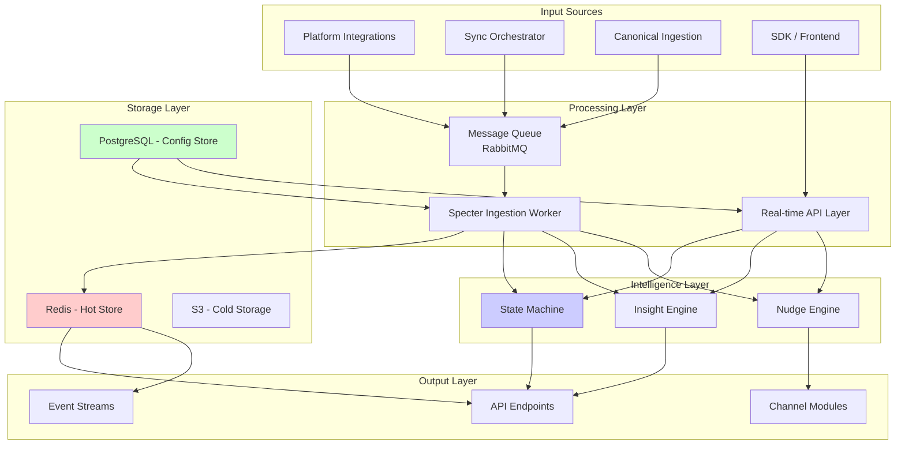
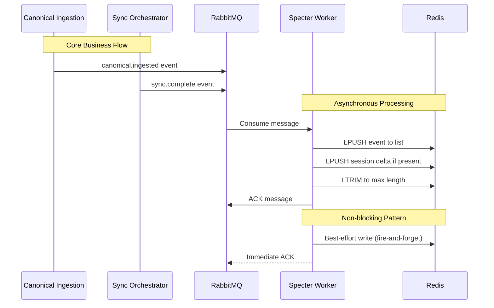
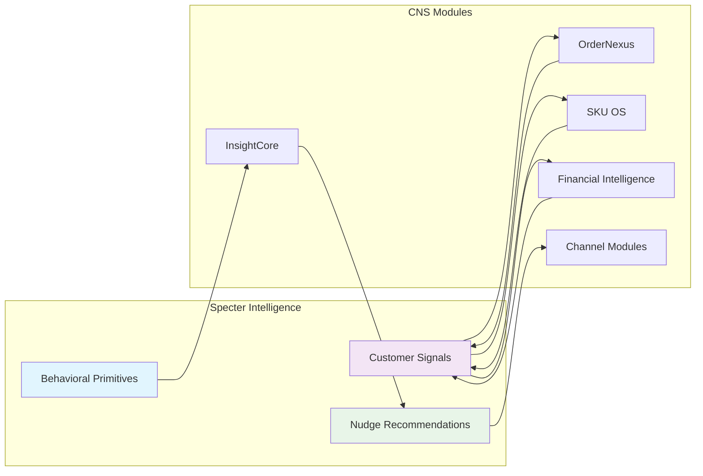

# Specter: System Architecture Overview

## Executive Summary

Specter employs a **dual-architecture** approach that supports both stateful observability and customer intelligence roles. The system is designed for high availability, low latency, and strict privacy compliance, with clear separation between operational and intelligence layers.

## High-Level Architecture



## Core Architecture Principles

### 1. Privacy by Design
- **Data Minimization**: Only collect what's absolutely necessary
- **PII Isolation**: Raw PII never persisted, only in-transit with immediate normalization
- **Aggregation First**: Prefer aggregated insights over individual tracking
- **Audit Trail**: All data transformations are logged and auditable

### 2. Latency Budgeting
- **100ms Decision Boundary**: Nudge recommendations must complete within 100ms
- **Graceful Degradation**: Timeouts trigger safe fallbacks, never errors
- **Async Processing**: Heavy computation deferred to background workers
- **Caching Strategy**: Multi-layer caching with intelligent invalidation

### 3. Operational Resilience
- **Circuit Breakers**: Prevent cascade failures
- **Retry with Backoff**: Intelligent retry mechanisms
- **Health Checks**: Comprehensive service health monitoring
- **Blue-Green Deployment**: Zero-downtime updates

## Component Architecture

### 1. Session Store Layer

#### Redis Implementation
```
specter:shop:{shopId}:sessions    → LIST[AnonymousSession]  (max: 1000)
specter:shop:{shopId}:events      → LIST[SpecterEvent]      (max: 50)
specter:shop:{shopId}:config      → STRING[ConfigJSON]
specter:shop:{shopId}:state       → HASH[StateMachine]      (FT1)
specter:shop:{shopId}:insights    → LIST[Insight]           (FT1)
specter:global:shops              → SET[shopIds]            (optional)
```

**Key Characteristics**:
- **Bounded Lists**: Automatic trimming via LTRIM to prevent unbounded growth
- **Newest-First**: LPUSH for O(1) writes, LRANGE 0,N for recent reads
- **TTL Strategies**: Configurable expiration per data type
- **Sharding Ready**: Key design supports horizontal sharding

#### In-Memory Fallback
```typescript
interface InMemorySessionStore {
  sessions: Map<number, CircularBuffer<AnonymousSession>>;
  events: Map<number, CircularBuffer<SpecterEvent>>;
  configs: Map<number, ShopConfig>;
  
  // Factory pattern for runtime selection
  static create(env: Environment): SessionStore;
}
```

### 2. Ingestion Pipeline



**Worker Characteristics**:
- **At-Least-Once Delivery**: RabbitMQ with manual acknowledgments
- **Idempotent Operations**: Duplicate events are safe
- **Batch Processing**: Configurable batch sizes for efficiency
- **Dead Letter Queues**: Failed messages go to DLQ for inspection

### 3. API Layer Architecture

#### REST API Endpoints
```typescript
// Core state endpoints
GET   /api/v1/specter/:shopId/state
GET   /api/v1/specter/:shopId/events?limit=50&offset=0
GET   /api/v1/specter/:shopId/sessions?days=7

// Configuration management
GET   /api/v1/specter/config
PUT   /api/v1/specter/config
PATCH /api/v1/specter/config

// Intelligence endpoints (FT1+)
POST  /api/v1/specter/:shopId/nudge-recommendation
GET   /api/v1/specter/:shopId/insights
POST  /api/v1/specter/:shopId/commands
```

#### GraphQL Subscriptions (FT1+)
```graphql
subscription {
  specterEvents(shopId: 42) {
    type
    timestamp
    payload
  }
  
  shopStateChanges(shopId: 42) {
    previousState
    newState
    reason
    timestamp
  }
}
```

### 4. Intelligence Engine Architecture

#### State Machine Implementation
```typescript
class ShopStateMachine {
  private states: Map<number, ShopState> = new Map();
  private transitions: TransitionRules;
  
  async processEvent(event: SpecterEvent): Promise<StateChange> {
    const currentState = await this.getState(event.shopId);
    const rules = this.transitions.getRules(currentState, event.type);
    
    if (rules.shouldTransition()) {
      const newState = rules.targetState;
      await this.setState(event.shopId, newState);
      
      // Emit state change event
      await this.emitStateChange({
        shopId: event.shopId,
        from: currentState,
        to: newState,
        trigger: event.type,
        timestamp: Date.now()
      });
      
      return { changed: true, newState };
    }
    
    return { changed: false };
  }
}
```

#### Nudge Engine Pipeline
```
Input Session
    ↓
[1] Privacy Normalization
    ↓
[2] Customer Signal Enrichment
    ↓
[3] Nudge Eligibility Check
    ↓
[4] Recommendation Generation
    ↓
[5] Safety Validation
    ↓
[6] Latency Budget Check
    ↓
Output: NudgeExecutionRequest | null
```

## Data Flow Patterns

### Pattern 1: Event Ingestion
```
Frontend SDK → HTTP API → Validation → Queue → Worker → Redis
                          ↳ Real-time Response    ↳ Async Processing
```

### Pattern 2: State Query
```
Client → HTTP API → Redis Store → Aggregation → Response
                   (Hot Data)    (Meta fields)
```

### Pattern 3: Intelligence Request
```
Client → HTTP API → Customer Signal Service → Nudge Engine → Response
         (Auth)     (PCD-safe)                (100ms budget)
```

### Pattern 4: Config Management
```
Admin UI → HTTP API → DB Validation → PostgreSQL → Redis Cache
                                     (Persistence) (Performance)
```

## Integration Architecture

### CNS (Central Nervous System) Integration



### Integration Contracts

#### 1. OrderNexus Contract
```typescript
interface OrderNexusIntegration {
  // Read-only aggregated profitability
  getCustomerProfitability(
    shopId: number, 
    hashedCustomerId: string
  ): Promise<AggregatedProfitability>;
  
  // Margin safety boundaries
  getMarginSafetyBoundaries(shopId: number): Promise<MarginBoundaries>;
}
```

#### 2. SKU OS Contract
```typescript
interface SkuOsIntegration {
  // Inventory risk signals
  getInventoryRisk(shopId: number, skuIds: string[]): Promise<RiskAssessment>;
  
  // Replenishment recommendations
  getReplenishmentSignals(shopId: number): Promise<ReplenishmentSignal[]>;
}
```

#### 3. Channel Module Contracts
```typescript
interface ChannelExecutionContract {
  // Specter provides recommendations
  executeNudge(request: NudgeExecutionRequest): Promise<ExecutionResult>;
  
  // Channel provides outcome feedback
  reportNudgeOutcome(outcome: NudgeOutcome): Promise<void>;
}
```

## Scalability Architecture

### Horizontal Scaling Strategy
```
                     ┌─────────────────┐
                     │  Load Balancer  │
                     └────────┬────────┘
                              │
        ┌──────────────┬──────┴──────┬──────────────┐
        │              │              │              │
┌───────▼──────┐┌─────▼──────┐┌─────▼──────┐┌──────▼──────┐
│   API Node 1 ││  API Node 2 ││  API Node 3 ││  API Node 4 │
│   (Stateless)││ (Stateless) ││ (Stateless) ││ (Stateless) │
└───────┬──────┘└─────┬──────┘└─────┬──────┘└──────┬──────┘
        │              │              │              │
        └──────────────┼──────────────┼──────────────┘
                       │              │
                ┌──────▼──────┐┌─────▼──────┐
                │  Redis      ││ PostgreSQL │
                │  Cluster    ││   Cluster  │
                │ (Sharded)   ││ (Read Replicas)│
                └──────────────┘└──────────────┘
```

### Data Partitioning Scheme
```typescript
// Shop-based sharding
function getShardKey(shopId: number): string {
  const shardCount = parseInt(process.env.REDIS_SHARD_COUNT || '4');
  const shardIndex = shopId % shardCount;
  return `redis-${shardIndex}`;
}

// Hot/cold data separation
interface DataRetentionPolicy {
  hotDataTTL: Duration;      // Redis: 7 days
  warmDataTTL: Duration;     // PostgreSQL: 30 days
  coldDataTTL: Duration;     // S3: 365 days
  archivalPolicy: ArchivalRule;
}
```

### Performance Targets
| **Metric** | **FT0 Target** | **FT1 Target** | **v2 Target** |
|------------|----------------|----------------|---------------|
| API Latency (P95) | < 50ms | < 30ms | < 20ms |
| Worker Throughput | 100 msg/sec | 1,000 msg/sec | 10,000 msg/sec |
| Concurrent Shops | 1,000 | 10,000 | 100,000 |
| Data Retention | 7 days hot | 30 days warm | 365 days archive |
| Uptime SLA | 99.5% | 99.9% | 99.95% |

## Security Architecture

### Multi-Layer Security Model
```
┌─────────────────────────────────────┐
│         Application Layer           │
│  • Input validation & sanitization  │
│  • PCD compliance checks            │
│  • Business logic authorization     │
├─────────────────────────────────────┤
│         API Gateway Layer           │
│  • Rate limiting                    │
│  • DDoS protection                  │
│  • Request signing                  │
├─────────────────────────────────────┤
│        Network Layer                │
│  • VPC isolation                    │
│  • Security groups                  │
│  • TLS termination                  │
├─────────────────────────────────────┤
│        Infrastructure Layer         │
│  • Secret management                │
│  • IAM roles                        │
│  • Audit logging                    │
└─────────────────────────────────────┘
```

### Privacy Controls
```typescript
class PrivacyControlMatrix {
  // Data classification
  private classifications = {
    PII: ['email', 'phone', 'address', 'name'],
    PCD: ['customerId', 'orderHistory', 'paymentInfo'],
    Anonymous: ['sessionId', 'pageViews', 'exitIntent']
  };
  
  // Transformation pipeline
  async processData(data: any): Promise<AnonymousData> {
    return await this.pipeline
      .stage('identification', this.stripIdentifiers)
      .stage('normalization', this.normalizeUrls)
      .stage('aggregation', this.aggregateWherePossible)
      .stage('auditing', this.logTransformation)
      .execute(data);
  }
}
```

## Monitoring & Observability

### Three Pillars of Observability

#### 1. Metrics
```typescript
interface SpecterMetrics {
  // Business metrics
  sessionsTracked: Counter;
  exitIntentsDetected: Counter;
  nudgesGenerated: Counter;
  conversionLift: Gauge;
  
  // Operational metrics
  apiLatency: Histogram;
  redisLatency: Histogram;
  workerLag: Gauge;
  errorRate: Counter;
  
  // Intelligence metrics
  signalConfidence: Gauge;
  nudgeRelevance: Histogram;
  predictionAccuracy: Gauge;
}
```

#### 2. Logging
```typescript
interface StructuredLogging {
  // Context fields (always included)
  timestamp: string;
  service: 'specter';
  environment: string;
  shopId?: number;
  sessionId?: string;
  
  // Event-specific fields
  eventType: string;
  durationMs?: number;
  success: boolean;
  error?: string;
  
  // Privacy-safe payload
  anonymizedPayload?: Record<string, any>;
}
```

#### 3. Tracing
```
Request → API Gateway → Auth → Business Logic → Redis → Response
   ↓         ↓           ↓          ↓            ↓        ↓
Trace ID → Span 1 →    Span 2 →   Span 3 →    Span 4 →  Span 5
```

### Health Check Endpoints
```
GET /health              # Basic liveness
GET /health/readiness    # Dependency readiness
GET /health/metrics      # Prometheus metrics
GET /health/detailed     # Component-level health
```

## Deployment Architecture

### Environment Strategy
```
Development → Staging → Canary → Production
    ↓           ↓         ↓         ↓
Feature Flags A/B Testing Blue-Green Zero-Downtime
```

### Infrastructure as Code
```yaml
# Example: Redis cluster configuration
specter_redis:
  type: aws_elasticache_replication_group
  engine: redis
  engine_version: '7.0'
  node_type: cache.r6g.large
  num_cache_clusters: 3
  automatic_failover_enabled: true
  multi_az_enabled: true
  snapshot_retention_limit: 7
  
  # Sharding configuration
  shard_count: 4
  replicas_per_shard: 2
  
  # Security
  transit_encryption_enabled: true
  at_rest_encryption_enabled: true
```

### CI/CD Pipeline
```yaml
stages:
  - test:
      - unit_tests
      - integration_tests
      - pcd_compliance_scan
      
  - build:
      - docker_build
      - vulnerability_scan
      - artifact_registry
      
  - deploy:
      - staging_deploy
      - smoke_tests
      - canary_release
      - production_deploy
      
  - monitor:
      - health_check
      - performance_test
      - rollback_if_needed
```

## Disaster Recovery

### Backup Strategy
```typescript
interface BackupConfiguration {
  // Redis backups
  redis: {
    frequency: 'hourly',
    retention: '7days',
    target: 's3://specter-backups/redis/'
  };
  
  // PostgreSQL backups
  postgres: {
    frequency: 'daily',
    retention: '30days',
    target: 's3://specter-backups/postgres/'
  };
  
  // Configuration backups
  configs: {
    frequency: 'real-time',
    retention: 'forever',
    target: 'git://config-repo/'
  };
}
```

### Recovery Procedures
1. **Redis Failure**: Switch to in-memory store, restore from backup
2. **PostgreSQL Failure**: Read-only mode, restore from backup
3. **Worker Failure**: Queue messages accumulate, process when restored
4. **API Failure**: Load balancer redirects to healthy instances
5. **Data Corruption**: Point-in-time recovery from backups

## Cost Optimization

### Resource Allocation
| **Component** | **Development** | **Staging** | **Production** |
|---------------|-----------------|-------------|----------------|
| Redis | t3.micro (shared) | cache.t3.medium | cache.r6g.large x3 |
| PostgreSQL | db.t3.micro | db.t3.medium | db.r6g.large x2 |
| Workers | t3.small x1 | t3.medium x2 | t3.large x4 |
| API Servers | t3.small x1 | t3.medium x2 | t3.xlarge x4 |

### Optimization Strategies
1. **Redis**: Data compression, TTL optimization, sharding
2. **PostgreSQL**: Connection pooling, read replicas, indexing
3. **Compute**: Auto-scaling, spot instances for workers
4. **Storage**: Tiered storage (hot/warm/cold)

---

## Architecture Evolution

### Current (FT0)
- Single Redis instance
- Basic session/event tracking
- Minimal intelligence layer
- Direct HTTP API

### Near-term (FT1)
- Redis cluster with sharding
- State machine implementation
- Insight engine
- WebSocket for real-time updates

### Medium-term (v2)
- Multi-region deployment
- Advanced intelligence with ML
- Full CNS integration
- Advanced caching strategy

### Long-term (v3)
- Edge computing for low latency
- Federated learning for privacy
- Predictive orchestration
- Autonomous optimization

---

*This architecture overview provides the technical foundation for Specter's dual-role implementation. For specific implementation details, refer to the implementation guide. For API specifications, refer to the API documentation.*