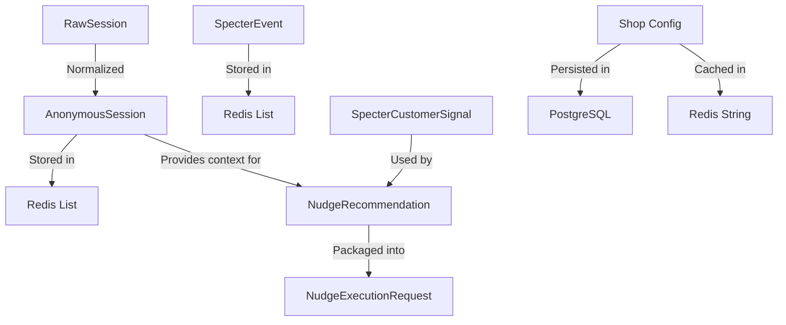

# Specter Data Models

## Overview

This document defines the core data structures used throughout the Specter module. These models are designed to be privacy-preserving, extensible, and aligned with both the stateful subsystem and customer intelligence roles.

---

## Session Models

### RawSession (Input/Transient)

The raw session data received from external sources. **Never persisted** due to potential PII.

```typescript
interface RawSession {
  shopId: number;           // Required: Merchant identifier
  customerId?: string;      // ⚠️ MUST NOT be persisted (PCD violation if present)
  landingPage: string;      // Original landing URL (may contain PII)
  pagesViewed: string[];    // Array of visited URLs (may contain PII)
  exitIntent: boolean;      // Whether exit intent was detected
}
```

### AnonymousSession (Persisted)

The privacy-safe version of session data that is stored in Redis.

```typescript
interface AnonymousSession {
  shopId: number;           // Merchant identifier
  sessionId: string;        // Generated UUID-like identifier
  landingPage: string;      // PII-stripped normalized URL
  pagesViewed: string[];    // Array of PII-stripped normalized URLs
  exitIntent: boolean;      // Exit intent detection flag
  createdAt: string;        // ISO 8601 timestamp
  // Additional fields may be added based on sessionDelta from workers
}
```

### Session Normalization Process

```typescript
// Example transformation in PrivacyGuards.normalizeSession()
const normalized: AnonymousSession = {
  shopId: raw.shopId,
  sessionId: generateSessionId(),          // e.g., "s-1a2b3c4d"
  landingPage: stripPIIFromUrl(raw.landingPage),
  pagesViewed: raw.pagesViewed.map(stripPIIFromUrl),
  exitIntent: raw.exitIntent,
  createdAt: new Date().toISOString()
};
```

---

## Event Models

### SpecterEvent (Event Ledger Entry)

Individual events stored in the Redis event ledger for each shop.

```typescript
interface SpecterEvent {
  type: string;             // Event type identifier
  timestamp: number;        // Unix timestamp in milliseconds
  payload?: Record<string, any>;  // Optional event-specific data
}

// Common Event Types (FT0)
type SpecterEventType = 
  | 'canonical.ingested'    // Order ingested into canonical model
  | 'sync.complete'         // Sync completed successfully
  | 'sync.error'            // Sync failed with error
  | 'session.created'       // New session tracked
  | 'exit_intent.detected'  // Customer showed exit intent
  // Additional types can be added as needed
```

### Event Payload Examples

```typescript
// canonical.ingested event
{
  type: 'canonical.ingested',
  timestamp: 1701388800000,
  payload: {
    orderCount: 1,
    totalValue: 99.99,
    platform: 'shopify'
  }
}

// sync.complete event
{
  type: 'sync.complete',
  timestamp: 1701388800000,
  payload: {
    durationMs: 2450,
    itemsSynced: 42,
    success: true
  }
}
```

---

## Customer Intelligence Models

### SpecterCustomerSignal

PCD-compliant customer intelligence signals used for nudge recommendations.

```typescript
interface SpecterCustomerSignal {
  shopId: number;                    // Merchant identifier
  hashedCustomerId: string;          // Privacy-safe customer identifier (if available)
  specterCustomerTier: CustomerTier; // Behavioral tier classification
  predictedLTV: number;              // Predicted lifetime value
  churnRisk: number;                 // 0-1 probability of churn
  priceSensitivity: number;          // 0-1 sensitivity to price changes
  returnsRisk: number;               // 0-1 likelihood of returns
  updatedAt: string;                 // ISO 8601 timestamp of last update
}

type CustomerTier = 
  | 'VIP'               // High-value, loyal customers
  | 'CORE'              // Regular, stable customers
  | 'PROMO_DEPENDENT'   // Primarily purchase during promotions
  | 'RISKY'             // High churn or return risk
  | 'UNKNOWN';          // Default for v1 (insufficient data)
```

### Default Signal (v1 Fallback)

```typescript
// Factory function for v1 default signals
function createDefaultCustomerSignal(
  shopId: number,
  hashedCustomerId: string
): SpecterCustomerSignal {
  return {
    shopId,
    hashedCustomerId,
    specterCustomerTier: 'UNKNOWN',
    predictedLTV: 0,
    churnRisk: 0.5,
    priceSensitivity: 0.5,
    returnsRisk: 0.1,
    updatedAt: new Date().toISOString()
  };
}
```

---

## Nudge Recommendation Models

### NudgeOffer

The offer component of a nudge recommendation.

```typescript
interface NudgeOffer {
  type: 'NONE' | 'PERCENT_DISCOUNT' | 'FIXED_DISCOUNT';
  value: number;              // 0.0-1.0 for percent, currency amount for fixed
  expiration: string | null;  // ISO 8601 expiration timestamp
  conditions: string[];       // Array of condition identifiers
}

// v1 Constraint: type is ALWAYS 'NONE' (no discounts)
```

### NudgeRecommendation

A complete nudge recommendation generated by Specter.

```typescript
interface NudgeRecommendation {
  shopId: number;             // Merchant identifier
  sessionId: string;          // Associated session ID
  channel: 'onsite';          // v1: onsite only
  nudgeType: 'REMINDER';      // v1: reminder only (no discounts)
  offer: NudgeOffer;          // Offer details (v1: always NONE)
  messageKey: string;         // Localization key for message
  reason: string;             // Human-readable reason for nudge
  expectedLift: number;       // Expected conversion lift (0-1)
  marginImpactEstimate: number; // Estimated margin impact (currency)
  confidence: number;         // Recommendation confidence (0-1)
}
```

### NudgeExecutionRequest

The packaged request sent to execution modules.

```typescript
interface NudgeExecutionRequest {
  recommendation: NudgeRecommendation;  // The nudge to execute
  sessionContext: AnonymousSession;     // Session context
  customerContext?: SpecterCustomerSignal; // Customer intelligence
  executionDeadline: string;            // ISO 8601 deadline for execution
}
```

---

## Database Models

### specter_shop_configs (PostgreSQL Table)

Persistent store for shop configuration.

```sql
CREATE TABLE specter_shop_configs (
  shop_id INTEGER PRIMARY KEY,
  config_json JSONB NOT NULL DEFAULT '{}',
  created_at TIMESTAMP WITH TIME ZONE DEFAULT NOW(),
  updated_at TIMESTAMP WITH TIME ZONE DEFAULT NOW()
);

-- Example row
{
  "shop_id": 42,
  "config_json": {
    "sync_frequency": "hourly",
    "retry_policy": { "max_attempts": 3, "backoff_ms": 5000 },
    "allowed_platforms": ["shopify", "woocommerce"],
    "event_ttl_days": 30,
    "session_ttl_days": 7
  },
  "created_at": "2024-01-15T10:30:00Z",
  "updated_at": "2024-01-15T10:30:00Z"
}
```

---

## Redis Data Structures

### Key Patterns and Serialization

| Key Pattern | Redis Type | Value Format | Description |
|-------------|------------|--------------|-------------|
| `specter:shop:{id}:sessions` | LIST | JSON(AnonymousSession) | Session history, newest first |
| `specter:shop:{id}:events` | LIST | JSON(SpecterEvent) | Event ledger, newest first |
| `specter:shop:{id}:config` | STRING | JSON(any) | Cached shop configuration |
| `specter:shop:{id}:state` | HASH | JSON (FT1) | Current state machine state |
| `specter:shop:{id}:insights` | LIST | JSON (FT1) | Generated insights |
| `specter:global:shops` | SET | string(shopId) | Active shops registry |

### Serialization Example

```javascript
// AnonymousSession in Redis LIST
{
  "shopId": 42,
  "sessionId": "s-abc123",
  "landingPage": "/products/widget",
  "pagesViewed": ["/products/widget", "/cart"],
  "exitIntent": true,
  "createdAt": "2024-01-15T10:30:00.000Z"
}

// Stored as JSON string in Redis
'{"shopId":42,"sessionId":"s-abc123","landingPage":"/products/widget","pagesViewed":["/products/widget","/cart"],"exitIntent":true,"createdAt":"2024-01-15T10:30:00.000Z"}'
```

---

## Privacy Compliance Models

### PII Stripping Rules

```typescript
// URL normalization for PII removal
function stripPIIFromUrl(url: string): string {
  const piiParams = [
    'email', 'e', 'user_email',
    'phone', 'tel', 'telephone',
    'name', 'first_name', 'last_name',
    'address', 'street', 'city', 'zip',
    'credit_card', 'cc', 'card_number'
  ];
  
  // Implementation returns pathname only for v1
  // Example: "/checkout?email=user@example.com" → "/checkout"
  return new URL(url, 'https://dummy.host').pathname;
}
```

### Privacy Guard Interface

```typescript
interface PrivacyGuard {
  assertNoRawCustomerId(raw: RawSession): void;
  stripPIIFromUrl(url: string): string;
  normalizeSession(raw: RawSession): AnonymousSession;
}
```

---

## Behavioral Primitives (CNS v2 Integration)

### Layer 1: Behavioral Primitives (v1/v1.5)

```typescript
interface BehavioralPrimitives {
  session_count: number;
  exit_intent_count: number;
  exit_intent_rate: number;  // exit_intent_count / session_count
  page_exit_intent_rate: Record<string, number>;
  top_exit_pages: Array<{ page: string, rate: number }>;
  nudge_opportunity: {
    page_key: string;
    exit_intent_rate: number;
    expected_lift: number;
    confidence: number;
  };
}
```

### Layer 2: Behavioral Drivers (v2 - Future)

```typescript
interface BehavioralDriver {
  driverId: string;                 // e.g., 'exit_intent_rate'
  weight: number;                   // Normalized 0–1
  confidence: 'low' | 'medium' | 'high';
  evidence: Record<string, any>;    // Aggregated-only support data
  timeWindow: '24h' | '7d' | '30d';
  correlationType: 'positive' | 'negative' | 'none';
}
```

---

## Type Relationships



---

## Version Compatibility

### v1 Constraints

- No raw customer identifiers in persisted data
- No discount offers - only REMINDER nudges with type 'NONE'
- Minimal customer intelligence - default signals only
- Onsite channel only - no email/SMS/push integration

### v2+ Extensions

- Enriched customer signals with OrderNexus/SKU OS data
- Enhanced behavioral primitives for CNS integration
- Additional nudge types with safe margin controls
- Multi-channel support with execution contracts

---

## Validation Rules

### Session Validation

```typescript
function validateRawSession(raw: RawSession): ValidationResult {
  if (raw.customerId) {
    return { valid: false, error: 'PCD_VIOLATION' };
  }
  if (!raw.shopId || raw.shopId <= 0) {
    return { valid: false, error: 'INVALID_SHOP_ID' };
  }
  if (!raw.landingPage) {
    return { valid: false, error: 'MISSING_LANDING_PAGE' };
  }
  return { valid: true };
}
```

### Event Validation

```typescript
function validateSpecterEvent(event: SpecterEvent): ValidationResult {
  if (!event.type || typeof event.type !== 'string') {
    return { valid: false, error: 'INVALID_EVENT_TYPE' };
  }
  if (!event.timestamp || event.timestamp <= 0) {
    return { valid: false, error: 'INVALID_TIMESTAMP' };
  }
  return { valid: true };
}
```

---

**Note:** These data models represent the current FT0 implementation with clear extension points for future phases. All models are designed to be backward-compatible as Specter evolves.