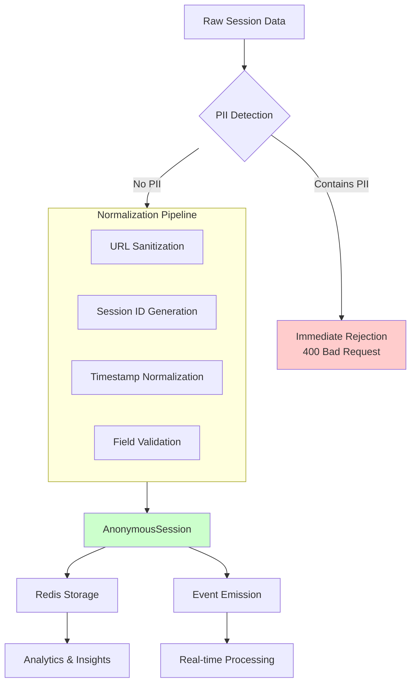

# Specter: PCD Compliance Framework

## Overview

Personally Identifiable Customer Data (PCD) compliance is a foundational principle of Specter. This document outlines the comprehensive privacy framework that ensures Specter never exposes or persists sensitive customer information while still providing valuable behavioral intelligence.

## Core Principles

### 1. Data Minimization

- Collect only what is absolutely necessary
- Discard PII at the earliest possible stage
- Prefer aggregated insights over individual data

### 2. Privacy by Design

- Privacy controls are built into the architecture, not added later
- Default settings maximize privacy
- Users remain anonymous by default

### 3. Non-Identification

- No ability to re-identify individuals from Specter data
- No joins with PII-bearing datasets
- Behavioral signals are cohort-based, not individual-based

## Data Classification

### Level 1: Raw PII (Never Persisted)

```typescript
// NEVER stored in Specter systems
type RawPII = {
  customerId: string;      // Direct customer identifiers
  email: string;
  phone: string;
  name: string;
  address: string;
  paymentInfo: string;
  ipAddress: string;       // Network identifiers
};
```

### Level 2: PCD (Transient Only)

```typescript
// May flow through systems but never persisted
type PCD = {
  orderHistory: Order[];    // Transaction history
  browsingHistory: PageView[]; // Complete session data
  customerAttributes: Record<string, any>; // Profile data
  locationData: GeoData;    // Geographical information
};
```

### Level 3: Anonymous Data (Persistable)

```typescript
// Safe to persist and analyze
type AnonymousData = {
  sessionId: string;        // Generated UUID
  shopId: number;           // Merchant identifier
  behavioralMetrics: BehavioralMetrics; // Aggregated patterns
  cohortFingerprint: string; // Group identifier
};
```

## Privacy Guard Implementation

### PrivacyGuard Class

```typescript
export class PrivacyGuard {
  // PII Detection Patterns
  private static piiPatterns = {
    email: /\b[A-Za-z0-9._%+-]+@[A-Za-z0-9.-]+\.[A-Z|a-z]{2,}\b/,
    phone: /(\+\d{1,3}[-.]?)?\(?\d{3}\)?[-.]?\d{3}[-.]?\d{4}\b/,
    ssn: /\b\d{3}[-]?\d{2}[-]?\d{4}\b/,
    creditCard: /\b(?:\d[ -]*?){13,16}\b/
  };

  // PII Query Parameters
  private static piiQueryParams = [
    'email', 'e', 'user_email', 'user_email_address',
    'phone', 'tel', 'telephone', 'mobile', 'cell',
    'name', 'first_name', 'last_name', 'full_name',
    'address', 'street', 'city', 'state', 'zip', 'postal_code',
    'credit_card', 'cc', 'card_number', 'card_holder',
    'cvv', 'security_code', 'expiry', 'expiration',
    'dob', 'birth_date', 'birthday', 'age'
  ];

  /**
   * Validate that no raw customer identifiers are present
   */
  static assertNoRawCustomerId(raw: RawSession): void {
    if (raw.customerId) {
      throw new PCDViolationError(
        'Raw customerId found in Specter payload',
        { field: 'customerId', value: '[REDACTED]' }
      );
    }
  }

  /**
   * Strip PII from URLs while preserving useful path information
   */
  static stripPIIFromUrl(url: string): string {
    try {
      const parsed = new URL(url, 'https://dummy.host');
      
      // Remove PII query parameters
      this.piiQueryParams.forEach(param => {
        parsed.searchParams.delete(param);
        parsed.searchParams.delete(param.toLowerCase());
        parsed.searchParams.delete(param.toUpperCase());
      });

      // Remove any query parameters that match PII patterns
      for (const [key, value] of parsed.searchParams.entries()) {
        if (this.detectPII(value)) {
          parsed.searchParams.delete(key);
        }
      }

      // Return only pathname for v1 (simplified approach)
      return parsed.pathname || '/';
      
    } catch (error) {
      // If URL parsing fails, return a safe default
      return '/invalid-url';
    }
  }

  /**
   * Detect PII in string values
   */
  private static detectPII(value: string): boolean {
    const normalized = value.toLowerCase().trim();
    
    // Check against patterns
    for (const [type, pattern] of Object.entries(this.piiPatterns)) {
      if (pattern.test(normalized)) {
        return true;
      }
    }

    // Check for common PII indicators
    const piiIndicators = [
      '@gmail.com', '@yahoo.com', '@hotmail.com',
      'john', 'smith', 'jane', 'doe',
      'main st', 'ave', 'blvd', 'street'
    ];

    return piiIndicators.some(indicator => 
      normalized.includes(indicator)
    );
  }

  /**
   * Transform raw session data into anonymous format
   */
  static normalizeSession(raw: RawSession): AnonymousSession {
    // Validate input
    this.assertNoRawCustomerId(raw);

    // Generate anonymous session ID
    const sessionId = this.generateAnonymousId(
      raw.shopId.toString(),
      Date.now().toString()
    );

    // Normalize URLs
    const landingPage = this.stripPIIFromUrl(raw.landingPage);
    const pagesViewed = raw.pagesViewed.map(page => 
      this.stripPIIFromUrl(page)
    );

    // Filter out any pages that became empty after normalization
    const validPages = pagesViewed.filter(page => 
      page && page !== '/invalid-url'
    );

    return {
      shopId: raw.shopId,
      sessionId,
      landingPage,
      pagesViewed: validPages,
      exitIntent: raw.exitIntent,
      createdAt: new Date().toISOString()
    };
  }

  /**
   * Generate anonymous identifier (non-reversible hash)
   */
  private static generateAnonymousId(...parts: string[]): string {
    const combined = parts.join(':');
    // Using SHA-256 for one-way hashing
    const hash = crypto.createHash('sha256');
    hash.update(combined);
    return `s-${hash.digest('hex').substring(0, 12)}`;
  }
}
```

## Session Data Flow with Privacy Controls



## Event Payload Sanitization

### Event Payload Rules

```typescript
interface EventSanitizationRules {
  // Fields that must be removed from all event payloads
  requiredRemovals: string[];
  
  // Fields that should be hashed if present
  hashIfPresent: string[];
  
  // Fields that can be kept in aggregated form only
  aggregateOnly: string[];
  
  // Maximum depth for nested objects
  maxDepth: number;
}

const defaultSanitizationRules: EventSanitizationRules = {
  requiredRemovals: [
    'customerId',
    'email',
    'phone',
    'name',
    'address',
    'ip',
    'userAgent',
    'deviceId',
    'browserFingerprint'
  ],
  
  hashIfPresent: [
    'userId',
    'sessionId',
    'orderId',
    'cartId'
  ],
  
  aggregateOnly: [
    'location',
    'deviceType',
    'browser',
    'platform'
  ],
  
  maxDepth: 3
};
```

### Event Sanitizer

```typescript
export class EventSanitizer {
  static sanitizePayload(
    payload: Record<string, any>,
    rules: EventSanitizationRules = defaultSanitizationRules
  ): Record<string, any> {
    const sanitized: Record<string, any> = {};
    
    for (const [key, value] of Object.entries(payload)) {
      // Skip required removal fields
      if (rules.requiredRemovals.includes(key)) {
        continue;
      }
      
      // Process value based on type
      if (value === null || value === undefined) {
        sanitized[key] = value;
      } else if (Array.isArray(value)) {
        sanitized[key] = this.sanitizeArray(value, rules, 1);
      } else if (typeof value === 'object') {
        sanitized[key] = this.sanitizeObject(value, rules, 1);
      } else if (rules.hashIfPresent.includes(key)) {
        sanitized[key] = this.hashValue(value.toString());
      } else {
        sanitized[key] = value;
      }
    }
    
    return sanitized;
  }
  
  private static sanitizeObject(
    obj: Record<string, any>,
    rules: EventSanitizationRules,
    depth: number
  ): Record<string, any> {
    if (depth >= rules.maxDepth) {
      return { _truncated: true };
    }
    
    const sanitized: Record<string, any> = {};
    for (const [key, value] of Object.entries(obj)) {
      if (rules.requiredRemovals.includes(key)) {
        continue;
      }
      
      if (typeof value === 'object' && value !== null) {
        sanitized[key] = Array.isArray(value)
          ? this.sanitizeArray(value, rules, depth + 1)
          : this.sanitizeObject(value, rules, depth + 1);
      } else if (rules.hashIfPresent.includes(key)) {
        sanitized[key] = this.hashValue(value.toString());
      } else {
        sanitized[key] = value;
      }
    }
    
    return sanitized;
  }
  
  private static sanitizeArray(
    arr: any[],
    rules: EventSanitizationRules,
    depth: number
  ): any[] {
    return arr.map(item => {
      if (typeof item === 'object' && item !== null) {
        return Array.isArray(item)
          ? this.sanitizeArray(item, rules, depth + 1)
          : this.sanitizeObject(item, rules, depth + 1);
      }
      return item;
    });
  }
  
  private static hashValue(value: string): string {
    const hash = crypto.createHash('sha256');
    hash.update(value);
    return `hash_${hash.digest('hex').substring(0, 8)}`;
  }
}
```

## Customer Signal Privacy

### Anonymous Customer Intelligence

```typescript
// Customer signals are computed without PII
interface PrivacySafeCustomerSignal {
  // Derived from behavior, not identity
  behavioralFingerprint: BehavioralFingerprint;
  
  // Aggregated metrics only
  engagementMetrics: AggregatedMetrics;
  
  // Cohort-based classification
  customerCohort: CustomerCohort;
  
  // Predictive models trained on anonymous data
  predictedBehaviors: AnonymousPredictions;
}

// Example behavioral fingerprint (no PII)
interface BehavioralFingerprint {
  sessionPatterns: {
    averageDuration: number;
    typicalPages: string[];
    timeOfDayPreference: number[];
  };
  conversionPath: {
    typicalPathLength: number;
    commonDropOffPoints: string[];
    highValuePages: string[];
  };
  responsiveness: {
    nudgeResponseRate: number;
    preferredNudgeTypes: string[];
    optimalTiming: TimeWindow[];
  };
}
```

## Data Retention and Deletion Policies

### Tiered Data Retention

```typescript
interface DataRetentionPolicy {
  // Hot data (Redis)
  hotRetention: {
    duration: Duration;  // 7 days
    autoDelete: boolean; // true
    compression: boolean; // false
  };
  
  // Warm data (PostgreSQL)
  warmRetention: {
    duration: Duration;  // 30 days
    autoDelete: boolean; // true
    anonymization: boolean; // true
  };
  
  // Cold data (Archival)
  coldRetention: {
    duration: Duration;  // 365 days
    autoDelete: boolean; // true
    encryption: boolean; // true
  };
  
  // Right to be forgotten
  deletion: {
    onRequest: boolean; // true
    timeframe: Duration; // 30 days
    verification: VerificationLevel; // HIGH
  };
}
```

### Automated Data Cleanup

```typescript
class DataCleanupService {
  async cleanupExpiredData(): Promise<CleanupReport> {
    const report: CleanupReport = {
      redisDeleted: 0,
      dbAnonymized: 0,
      archived: 0,
      errors: []
    };

    // Clean Redis (hot data)
    try {
      const redisKeys = await this.scanRedisKeys('specter:*');
      for (const key of redisKeys) {
        const ttl = await this.getRedisTTL(key);
        if (ttl < 0) { // Expired
          await this.deleteRedisKey(key);
          report.redisDeleted++;
        }
      }
    } catch (error) {
      report.errors.push({ source: 'redis', error });
    }

    // Anonymize old database records
    try {
      const oldRecords = await this.getOldRecords('specter_events', '30 days');
      for (const record of oldRecords) {
        await this.anonymizeRecord(record);
        report.dbAnonymized++;
      }
    } catch (error) {
      report.errors.push({ source: 'database', error });
    }

    return report;
  }
}
```

## Compliance Monitoring and Auditing

### Audit Logging

```typescript
interface PrivacyAuditLog {
  timestamp: string;
  eventType: PrivacyEventType;
  actor: string; // System or user identifier
  action: string;
  dataCategory: DataCategory;
  justification?: string;
  beforeState?: Record<string, any>;
  afterState?: Record<string, any>;
  complianceCheck: ComplianceCheckResult;
}

type PrivacyEventType = 
  | 'PII_DETECTION'
  | 'DATA_DELETION'
  | 'DATA_ACCESS'
  | 'CONSENT_CHANGE'
  | 'RETENTION_CHECK'
  | 'EXPORT_REQUEST';

type ComplianceCheckResult = {
  passed: boolean;
  violations: PrivacyViolation[];
  recommendations: string[];
};
```

### Automated Compliance Checks

```typescript
class ComplianceMonitor {
  async runDailyComplianceCheck(): Promise<ComplianceReport> {
    const checks = [
      this.checkDataRetention(),
      this.checkAccessLogs(),
      this.checkPIIInStorage(),
      this.checkConsentRecords(),
      this.checkThirdPartyIntegrations()
    ];

    const results = await Promise.allSettled(checks);
    
    return {
      timestamp: new Date().toISOString(),
      overallStatus: this.calculateOverallStatus(results),
      checks: results.map((r, i) => ({
        check: checks[i].name,
        status: r.status,
        details: r.status === 'fulfilled' ? r.value : r.reason
      })),
      violations: this.aggregateViolations(results),
      recommendations: this.generateRecommendations(results)
    };
  }

  private async checkPIIInStorage(): Promise<PIIAuditResult> {
    // Scan Redis for potential PII
    const suspiciousKeys = await this.scanForPIIPatterns();
    
    // Check database for unanonymized records
    const rawData = await this.findRawCustomerData();
    
    return {
      hasPII: suspiciousKeys.length > 0 || rawData.length > 0,
      suspiciousKeys,
      rawDataSamples: rawData.slice(0, 5), // Limited for privacy
      actionRequired: suspiciousKeys.length > 0
    };
  }
}
```

## Integration Privacy Contracts

### Module Integration Guidelines

```typescript
interface PrivacyIntegrationContract {
  // Data Flow Restrictions
  allowedDataTypes: DataCategory[];
  prohibitedDataTypes: DataCategory[];
  
  // Processing Requirements
  anonymizationRequired: boolean;
  aggregationLevel: AggregationLevel;
  retentionPeriod: Duration;
  
  // Security Requirements
  encryptionRequired: boolean;
  accessLoggingRequired: boolean;
  auditTrailRequired: boolean;
  
  // Compliance Requirements
  gdprCompliant: boolean;
  ccpaCompliant: boolean;
  hipaaCompliant: boolean; // If applicable
  
  // Breach Response
  notificationTimeline: Duration;
  remediationSteps: string[];
}
```

### Example: OrderNexus Integration Contract

```json
{
  "integration": "OrderNexus -> Specter",
  "version": "1.0",
  "dataCategories": ["profitability_metrics", "order_patterns"],
  "prohibited": ["customer_ids", "order_details", "payment_info"],
  "anonymization": {
    "required": true,
    "method": "aggregation",
    "minimumGroupSize": 10
  },
  "retention": {
    "hot": "7days",
    "warm": "30days",
    "cold": "90days"
  },
  "accessControls": {
    "readOnly": true,
    "noExport": true,
    "noReIdentification": true
  }
}
```

## Privacy-Preserving Analytics

### Differential Privacy

```typescript
class DifferentialPrivacyEngine {
  private epsilon: number;
  private sensitivity: number;

  constructor(epsilon: number = 0.1, sensitivity: number = 1) {
    this.epsilon = epsilon;
    this.sensitivity = sensitivity;
  }

  /**
   * Add Laplace noise for differential privacy
   */
  addNoise(value: number): number {
    const scale = this.sensitivity / this.epsilon;
    const noise = this.laplaceRandom(0, scale);
    return value + noise;
  }

  /**
   * Aggregate data with privacy guarantees
   */
  private laplaceRandom(location: number, scale: number): number {
    const u = Math.random() - 0.5;
    return location - scale * Math.sign(u) * Math.log(1 - 2 * Math.abs(u));
  }

  /**
   * Generate privacy-safe statistics
   */
  async computePrivateStatistics(
    data: number[],
    operation: 'sum' | 'mean' | 'count'
  ): Promise<PrivateResult> {
    const rawResult = this.computeRaw(data, operation);
    const noisyResult = this.addNoise(rawResult);
    
    return {
      value: noisyResult,
      privacyBudgetUsed: this.epsilon,
      confidenceInterval: this.computeConfidenceInterval(noisyResult),
      isPrivate: true
    };
  }
}
```

### Cohort-Based Analysis

```typescript
interface PrivacySafeCohort {
  cohortId: string;
  size: number; // Minimum size for privacy
  characteristics: CohortCharacteristics;
  behavioralPatterns: BehavioralPatterns;
  insights: CohortInsights[];
}

// Minimum cohort size to prevent individual identification
const MIN_COHORT_SIZE = 50;

class CohortAnalysis {
  async analyzeCohorts(data: AnonymousSession[]): Promise<PrivacySafeCohort[]> {
    // Group sessions into cohorts based on behavior
    const cohorts = this.groupIntoCohorts(data);
    
    // Filter out cohorts that are too small
    const safeCohorts = cohorts.filter(cohort => 
      cohort.size >= MIN_COHORT_SIZE
    );
    
    // For small cohorts, aggregate with similar cohorts
    const smallCohorts = cohorts.filter(cohort => 
      cohort.size < MIN_COHORT_SIZE
    );
    
    if (smallCohorts.length > 0) {
      const aggregated = this.aggregateSmallCohorts(smallCohorts);
      safeCohorts.push(aggregated);
    }
    
    return safeCohorts.map(cohort => this.anonymizeCohort(cohort));
  }
}
```

## Incident Response Procedures

### PII Breach Response Plan

```typescript
interface BreachResponsePlan {
  detection: {
    automatedMonitoring: boolean;
    alertThresholds: AlertThresholds;
    escalationPath: EscalationPath;
  };
  
  containment: {
    immediateActions: string[];
    systemIsolation: boolean;
    dataFreeze: boolean;
  };
  
  investigation: {
    forensicAnalysis: ForensicProcedure[];
    rootCauseAnalysis: boolean;
    impactAssessment: ImpactAssessmentMethod;
  };
  
  notification: {
    internal: NotificationTimeline;
    regulatory: RegulatoryNotification[];
    affectedParties: PartyNotification[];
  };
  
  remediation: {
    systemFixes: string[];
    dataRemediation: DataRemediationSteps[];
    policyUpdates: PolicyUpdate[];
  };
  
  prevention: {
    systemHardening: string[];
    training: TrainingProgram[];
    ongoingMonitoring: MonitoringPlan;
  };
}
```

### Breach Detection and Response

```typescript
class BreachDetectionService {
  async monitorForBreaches(): Promise<BreachDetectionResult> {
    const indicators = await Promise.all([
      this.checkAccessPatterns(),
      this.checkDataExfiltration(),
      this.checkPIIExposure(),
      this.checkComplianceViolations()
    ]);

    const potentialBreaches = indicators.filter(i => i.indicationOfBreach);
    
    if (potentialBreaches.length > 0) {
      await this.initiateBreachResponse(potentialBreaches);
      return {
        breachDetected: true,
        severity: this.calculateSeverity(potentialBreaches),
        indicators: potentialBreaches,
        timestamp: new Date().toISOString()
      };
    }

    return { breachDetected: false };
  }

  private async initiateBreachResponse(indicators: BreachIndicator[]): Promise<void> {
    // Immediate containment
    await this.isolateAffectedSystems();
    await this.freezeDataAccess();
    
    // Alert response team
    await this.notifyResponseTeam(indicators);
    
    // Begin forensic analysis
    await this.startForensicAnalysis(indicators);
    
    // Log everything for audit trail
    await this.logBreachResponse(indicators);
  }
}
```

## Training and Awareness

### Required Training Modules

```markdown
## Privacy Training Curriculum

### Module 1: PCD Fundamentals
- What constitutes PII/PCD
- Legal and regulatory requirements
- Specter's privacy philosophy

### Module 2: Data Handling Procedures
- Safe data collection practices
- Proper anonymization techniques
- Secure data storage and transmission

### Module 3: Incident Response
- Recognizing potential breaches
- Immediate response actions
- Escalation procedures

### Module 4: Tool-Specific Training
- Using PrivacyGuard class
- Event sanitization best practices
- Compliance monitoring tools

### Assessment
- Quarterly knowledge checks
- Practical scenario testing
- Certification renewal annually
```

## Compliance Documentation

### Required Documentation

```typescript
interface ComplianceDocumentation {
  // Policy Documents
  privacyPolicy: DocumentVersion;
  dataProcessingAgreement: DocumentVersion;
  retentionPolicy: DocumentVersion;
  
  // Technical Documentation
  dataFlowDiagrams: DataFlowDocumentation[];
  securityArchitecture: SecurityDocumentation;
  auditTrailSpecification: AuditSpecification;
  
  // Operational Documentation
  incidentResponsePlan: ResponsePlanDocumentation;
  trainingMaterials: TrainingDocumentation[];
  thirdPartyAssessments: ThirdPartyAssessment[];
  
  // Regulatory Documentation
  dpia: DataProtectionImpactAssessment; // GDPR requirement
  recordsOfProcessing: ProcessingRecords; // GDPR Article 30
  breachRegister: BreachRegister;
}
```

### Data Protection Impact Assessment (DPIA)

```typescript
interface DPIA {
  projectDescription: string;
  necessityAndProportionality: string;
  riskAssessment: {
    risks: PrivacyRisk[];
    likelihood: RiskLikelihood;
    severity: RiskSeverity;
    mitigation: RiskMitigation[];
  };
  consultation: {
    stakeholders: string[];
    feedback: string;
    decisions: string[];
  };
  approval: {
    dpoOpinion: string;
    managementApproval: boolean;
    date: string;
  };
  reviewSchedule: ReviewSchedule;
}
```

## Testing and Validation

### Privacy Test Suite

```typescript
describe('PCD Compliance', () => {
  describe('PrivacyGuard', () => {
    it('throws when raw customerId is present', () => {
      const rawSession: RawSession = {
        shopId: 1,
        customerId: '123', // PCD violation
        landingPage: '/test',
        pagesViewed: [],
        exitIntent: false
      };

      expect(() => PrivacyGuards.normalizeSession(rawSession))
        .toThrow('PCD_VIOLATION');
    });

    it('strips PII from URLs', () => {
      const rawSession: RawSession = {
        shopId: 1,
        landingPage: '/test?email=user@example.com&phone=123',
        pagesViewed: ['/page?name=John&address=123MainSt'],
        exitIntent: false
      };

      const normalized = PrivacyGuards.normalizeSession(rawSession);

      expect(normalized.landingPage).toBe('/test');
      expect(normalized.pagesViewed[0]).toBe('/page');
    });

    it('generates anonymous session IDs', () => {
      const rawSession: RawSession = {
        shopId: 1,
        landingPage: '/test',
        pagesViewed: [],
        exitIntent: false
      };

      const normalized = PrivacyGuards.normalizeSession(rawSession);
      
      expect(normalized.sessionId).toMatch(/^s-[a-f0-9]{12}$/);
      expect(normalized.sessionId).not.toContain('1'); // No shopId leak
    });
  });

  describe('EventSanitizer', () => {
    it('removes PII from event payloads', () => {
      const payload = {
        customerId: '123',
        email: 'user@example.com',
        orderValue: 99.99,
        items: ['product1', 'product2']
      };

      const sanitized = EventSanitizer.sanitizePayload(payload);
      
      expect(sanitized.customerId).toBeUndefined();
      expect(sanitized.email).toBeUndefined();
      expect(sanitized.orderValue).toBe(99.99);
      expect(sanitized.items).toEqual(['product1', 'product2']);
    });

    it('hashes identifiers when required', () => {
      const payload = {
        userId: 'user_123',
        sessionId: 'session_456',
        action: 'purchase'
      };

      const sanitized = EventSanitizer.sanitizePayload(payload);
      
      expect(sanitized.userId).toMatch(/^hash_[a-f0-9]{8}$/);
      expect(sanitized.sessionId).toMatch(/^hash_[a-f0-9]{8}$/);
      expect(sanitized.action).toBe('purchase');
    });
  });
});
```

### Compliance Audit Tests

```typescript
describe('Compliance Audit', () => {
  let complianceMonitor: ComplianceMonitor;

  beforeEach(() => {
    complianceMonitor = new ComplianceMonitor();
  });

  it('detects PII in storage', async () => {
    // Seed test data with potential PII
    await seedTestDataWithPII();
    
    const result = await complianceMonitor.checkPIIInStorage();
    
    expect(result.hasPII).toBe(true);
    expect(result.actionRequired).toBe(true);
  });

  it('validates data retention policies', async () => {
    const retentionCheck = await complianceMonitor.checkDataRetention();
    
    expect(retentionCheck.oldDataPresent).toBe(false);
    expect(retentionCheck.oldestRecordAge).toBeLessThan(
      retentionCheck.maxAllowedAge
    );
  });

  it('verifies access controls', async () => {
    const accessCheck = await complianceMonitor.checkAccessLogs();
    
    expect(accessCheck.unusualAccessPatterns).toHaveLength(0);
    expect(accessCheck.missingLogs).toHaveLength(0);
    expect(accessCheck.compliant).toBe(true);
  });
});
```

## Continuous Compliance Monitoring

### Real-time Monitoring Dashboard

```typescript
interface PrivacyDashboardMetrics {
  // Data Protection Metrics
  piiDetectionCount: number;
  anonymizationRate: number;
  retentionCompliance: number;
  
  // Access Control Metrics
  unauthorizedAccessAttempts: number;
  privilegedAccessReviews: number;
  accessPolicyViolations: number;
  
  // Incident Metrics
  privacyIncidents: number;
  meanTimeToDetection: number;
  meanTimeToResolution: number;
  
  // Training Metrics
  trainingCompletionRate: number;
  awarenessAssessmentScores: number[];
  certificationRenewals: number;
}

class PrivacyDashboard {
  async getDashboardData(): Promise<PrivacyDashboard> {
    const [
      protectionMetrics,
      accessMetrics,
      incidentMetrics,
      trainingMetrics
    ] = await Promise.all([
      this.collectProtectionMetrics(),
      this.collectAccessMetrics(),
      this.collectIncidentMetrics(),
      this.collectTrainingMetrics()
    ]);

    return {
      protectionMetrics,
      accessMetrics,
      incidentMetrics,
      trainingMetrics,
      overallScore: this.calculateOverallScore(
        protectionMetrics,
        accessMetrics,
        incidentMetrics,
        trainingMetrics
      ),
      lastUpdated: new Date().toISOString()
    };
  }
}
```

## Conclusion

Specter's PCD compliance framework is built on the principle that privacy is not a feature, but a fundamental requirement. By implementing these controls:

1. **Data is protected by design**, not as an afterthought
2. **Anonymity is preserved** throughout the data lifecycle
3. **Compliance is automated** and continuously monitored
4. **Breaches are prevented** through multiple layers of protection

This framework ensures that Specter can provide valuable customer intelligence while maintaining the highest standards of privacy and data protection.

---

*For specific implementation questions or compliance concerns, contact the Privacy & Compliance team. All changes to privacy controls must be reviewed and approved by the Data Protection Officer (DPO).*

```
