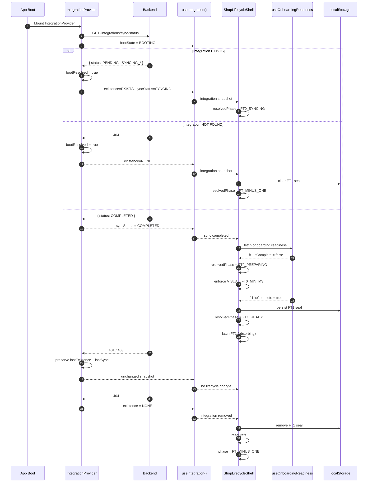

## 🔁 Shop Lifecycle — Runtime Sequence (Mermaid)

---

## 🔒 What This Diagram Guarantees

* **No UI flicker**
* **FT1 is absorbing**
* **Auth churn is ignored**
* **Integration deletion is the only reset**
* **FT0 minimum dwell is enforced**
* **Lifecycle cannot regress accidentally**

---

## 🧠 Mental Model (One Sentence)

> IntegrationProvider stabilizes reality → useIntegration exposes facts → ShopLifecycleShell enforces time, order, and irreversibility.

---